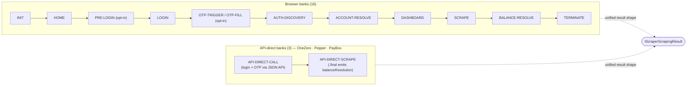

<a id="readme-top"></a>

<!-- ALL-CONTRIBUTORS-BADGE:START -->

[](#contributors-)

<!-- ALL-CONTRIBUTORS-BADGE:END -->

[](https://www.npmjs.com/package/@sergienko4/israeli-bank-scrapers)
[](https://github.com/sergienko4/israeli-bank-scrapers/actions)
[](https://www.typescriptlang.org)
[](./LICENSE)
[](https://sergienko4.github.io/israeli-bank-scrapers/api/)
[](https://www.npmjs.com/package/@sergienko4/israeli-bank-scrapers)
[](https://sonarcloud.io/summary/overall?id=sergienko4_israeli-bank-scrapers)
[](https://securityscorecards.dev/viewer/?uri=github.com/sergienko4/israeli-bank-scrapers)
[](https://nodejs.org/)

# Israeli Bank Scrapers

Scrape transactions from **19 Israeli banks and credit card companies** with built-in **Cloudflare WAF bypass** and **end-to-end PII redaction**.

Maintained fork of [eshaham/israeli-bank-scrapers](https://github.com/eshaham/israeli-bank-scrapers), rewritten on a typed phase-based pipeline using [Camoufox](https://github.com/daijro/camoufox) (Firefox anti-detect), Playwright, and TypeScript 6.0 strict mode.

```sh
npm install @sergienko4/israeli-bank-scrapers
```

## Architecture at a glance



12 phases for browser banks, 2 phases for api-direct banks, **one result shape**. Each phase owns its mediator zone and its own state — phases never reach into each other's data. See [Architecture](#architecture) for the contract that keeps the wiring honest.

> **📚 Full documentation:** [User Guide & Architecture (mkdocs)](https://sergienko4.github.io/israeli-bank-scrapers/) · [API Reference (TypeDoc)](https://sergienko4.github.io/israeli-bank-scrapers/api/) · [Changelog](./CHANGELOG.md) · [Contributing](./CONTRIBUTING.md)

<!-- START doctoc generated TOC please keep comment here to allow auto update -->
<!-- DON'T EDIT THIS SECTION, INSTEAD RE-RUN doctoc TO UPDATE -->

**Table of Contents**

- [Quick Start](#quick-start)
- [Features](#features)
- [Prerequisites](#prerequisites)
- [Usage](#usage)
  - [Sample Output](#sample-output)
- [Supported Institutions](#supported-institutions)
- [OTP (Two-Factor Authentication)](#otp-two-factor-authentication)
  - [Phone input contract](#phone-input-contract)
- [Error Types](#error-types)
- [Configuration](#configuration)
- [Testing](#testing)
- [Logging & Bug Reports](#logging--bug-reports)
  - [What gets redacted, and what survives](#what-gets-redacted-and-what-survives)
  - [Filing a bug report](#filing-a-bug-report)
  - [How redaction stays correct over time](#how-redaction-stays-correct-over-time)
- [Architecture](#architecture)
- [Advanced Usage](#advanced-usage)
- [Contributing](#contributing)
- [Version history](#version-history)
- [Contributors](#contributors)
- [Links](#links)
- [Known Projects](#known-projects)
- [License](#license)

<!-- END doctoc generated TOC please keep comment here to allow auto update -->

## Quick Start

Three steps to get transactions from Bank Hapoalim:

```typescript
import { CompanyTypes, createScraper } from '@sergienko4/israeli-bank-scrapers';

const scraper = createScraper({
  companyId: CompanyTypes.Hapoalim,
  startDate: new Date('2024-01-01'),
});

const result = await scraper.scrape({
  userCode: '1234567',
  password: 'mypassword',
});

if (result.success) {
  result.accounts?.forEach(acc => {
    console.log(`${acc.accountNumber}: ${acc.txns.length} txns, balance ${acc.balance}`);
  });
}
```

Replace `userCode` and `password` with real credentials. See [Supported Institutions](#supported-institutions) for other banks and credential fields, and [OTP](#otp-two-factor-authentication) for banks that require an `otpCodeRetriever` callback.

## Features

- **WAF bypass on the first attempt** — Camoufox (Firefox anti-detect) instead of Puppeteer, no stealth shims.
- **Zero CSS selectors in interaction code** — visible Hebrew text + a 7-strategy `SelectorResolver`. Site UI redesigns rarely break logins.
- **Auto-detect + auto-fill OTP** — either via a callback you provide or a stable long-term token (returned for API banks).
- **End-to-end PII redaction** — every log line, captured network body, and DOM snapshot goes through one redactor _before_ it touches disk. Share traces publicly without leaking customer data.
- **Phase-based pipeline** — 12 isolated phases for browser banks, 2 for api-direct banks. One result shape across both paths.
- **Single-phase balance ownership (v6)** — `BALANCE-RESOLVE` owns every live balance fetch + per-card extraction; legitimate empty-month results pass through without a false "scrape failed" signal.
- **Dual ESM + CJS** — works with both `import` and `require()`.
- **3 test surfaces** — unit (Jest), pipeline coverage (with thresholds), mock + real E2E orchestrators.

## Prerequisites

| Requirement          | Minimum                                 | Why                                                                                                         |
| -------------------- | --------------------------------------- | ----------------------------------------------------------------------------------------------------------- |
| **Node.js**          | `>= 22.14.0`                            | ESM-by-default + `node:crypto` `randomUUID` used by the pipeline correlationId.                             |
| **npm**              | `>= 10`                                 | Workspaces + `--access public` provenance.                                                                  |
| **OS**               | Windows / macOS / Linux                 | Camoufox ships native binaries for all three (downloaded on `npm install`).                                 |
| **Disk**             | ~500 MB for the Camoufox browser bundle | Cached under `~/.cache/camoufox` after first install.                                                       |
| **Bank credentials** | Per-bank, real                          | See [Supported Institutions](#supported-institutions). The library never registers accounts on your behalf. |
| **OTP callback**     | For banks that require it               | A `Promise<string>` returning the SMS code. See [OTP](#otp-two-factor-authentication).                      |

Environment variables (all optional):

| Variable        | Default | Effect                                                                                                       |
| --------------- | ------- | ------------------------------------------------------------------------------------------------------------ |
| `PII_REDACTION` | `on`    | Set to `off` to disable redaction _for real-bank E2E only_. Unit tests always run with redaction default-on. |
| `MOCK_MODE`     | unset   | `1` switches `test:mock` to its fixture-driven path.                                                         |

Per-phase navigation timeout is controlled by the `defaultTimeout` scraper **option** (not an env var) — see [Configuration → Scraper options](#configuration).

## Usage

```typescript
import { CompanyTypes, createScraper } from '@sergienko4/israeli-bank-scrapers';

const scraper = createScraper({
  companyId: CompanyTypes.Amex,
  startDate: new Date('2024-01-01'),
});

const result = await scraper.scrape({
  id: '123456789',
  card6Digits: '123456',
  password: 'mypassword',
});

if (result.success) {
  for (const account of result.accounts!) {
    console.log(`${account.accountNumber}: ${account.txns.length} transactions`);
  }
} else {
  console.error(result.errorType, result.errorMessage);
  if (result.errorDetails) {
    console.error('Suggestions:', result.errorDetails.suggestions);
  }
}
```

### Sample Output

```json
{
  "success": true,
  "accounts": [
    {
      "accountNumber": "****1234",
      "balance": 0,
      "txns": [
        {
          "date": "2024-01-15",
          "description": "<merchant:12>",
          "originalAmount": -***,
          "chargedAmount": -***
        }
      ]
    }
  ]
}
```

This snippet shows the redacted shape produced by the [redaction layer](#logging--bug-reports). Real balances, amounts, and merchant strings are masked; account numbers are tail-only. The `balance` field is populated by `BALANCE-RESOLVE.final` (browser banks) or `API-DIRECT-SCRAPE.final` (api-direct banks) — one source of truth across both paths.

## Supported Institutions

19 institutions across three categories. `CompanyTypes.<Name>` is the discriminator passed to `createScraper`; credential field names are validated at runtime against the tables below.

<details open>
<summary><strong>🏦 Banks</strong> (14)</summary>

| Institution        | Engine     | Credentials                          |
| ------------------ | ---------- | ------------------------------------ |
| Bank Hapoalim      | Browser    | `userCode`, `password`, OTP          |
| Bank Leumi         | Browser    | `username`, `password`               |
| Bank Otsar Hahayal | Browser    | `username`, `password`, OTP          |
| Bank Yahav         | Browser    | `username`, `nationalID`, `password` |
| Behatsdaa          | Browser    | `id`, `password`                     |
| Beinleumi          | Browser    | `username`, `password`, OTP          |
| Beyahad Bishvilha  | Browser    | `id`, `password`                     |
| Discount Bank      | Browser    | `id`, `password`, `num`              |
| Massad             | Browser    | `username`, `password`, OTP          |
| Mercantile Bank    | Browser    | `id`, `password`, `num`              |
| Mizrahi Bank       | Browser    | `username`, `password`               |
| One Zero           | API-direct | `email`, `password`, OTP             |
| Pagi               | Browser    | `username`, `password`, OTP          |
| Pepper (by Leumi)  | API-direct | `phoneNumber`, `password`, OTP       |

</details>

<details>
<summary><strong>💳 Credit Cards</strong> (4)</summary>

| Issuer   | Engine  | Credentials                     |
| -------- | ------- | ------------------------------- |
| Amex     | Browser | `id`, `card6Digits`, `password` |
| Isracard | Browser | `id`, `card6Digits`, `password` |
| Max      | Browser | `username`, `password`          |
| Visa Cal | Browser | `username`, `password`          |

</details>

<details>
<summary><strong>👛 Wallets</strong> (1)</summary>

| Wallet                    | Engine     | Credentials        |
| ------------------------- | ---------- | ------------------ |
| PayBox (by Discount Bank) | API-direct | `phoneNumber`, OTP |

</details>

> **Migration notice (wide-net policy):** 5 banks are still on the **legacy** scraper path — _Behatsdaa_, _Beyahad Bishvilha_, _Bank Leumi_, _Mizrahi Bank_, _Bank Yahav_. They keep working through the same `createScraper(...)` entry point, but new features and bug fixes target the Pipeline architecture. They are scheduled for migration; the broader `src/Scrapers/Base/`, `src/Common/`, and legacy bank folders are also on the migration path and will be folded into `src/Scrapers/Pipeline/` over time. Public API behavior is preserved.

## OTP (Two-Factor Authentication)

<details open>
<summary><strong>Browser banks</strong> (Beinleumi group, Hapoalim, Massad, Otsar Hahayal, Pagi) — pass callback in options</summary>

```typescript
createScraper({
  companyId: CompanyTypes.Beinleumi,
  startDate,
  otpCodeRetriever: async phoneHint => await getCodeFromUser(phoneHint),
});
```

> **Hapoalim:** OTP is conditional. When the bank detects a login from an unrecognized device, it prompts for an SMS code, invoking the `otpCodeRetriever` callback. On remembered devices, no OTP is requested.

</details>

<details>
<summary><strong>API banks</strong> (OneZero, Pepper, PayBox) — pass callback in credentials, save the token for next run</summary>

```typescript
await scraper.scrape({
  email,
  password,
  phoneNumber: '972000000000',
  otpCodeRetriever: async () => '123456',
});
// result.persistentOtpToken — save to skip SMS next run
```

</details>

### Phone input contract

Every API bank that accepts a `phoneNumber` credential reads digits-only international form (no `+`, no dashes). For example: `'972000000000'`. The pipeline edge rewrites this into each bank's wire format on the fly:

| Bank    | Wire format        | Example         |
| ------- | ------------------ | --------------- |
| OneZero | international-plus | `+972000000000` |
| Pepper  | international-flat | `972000000000`  |
| PayBox  | international-dash | `972-000000000` |

You don't have to know which format each bank wants — pass the international digits and the mediator normalises before login.

## Error Types

| Error                          | Meaning                                                                         |
| ------------------------------ | ------------------------------------------------------------------------------- |
| `INVALID_PASSWORD`             | Wrong credentials                                                               |
| `INVALID_OTP`                  | Wrong/expired OTP code                                                          |
| `WAF_BLOCKED`                  | Cloudflare block — check `errorDetails.suggestions`                             |
| `TIMEOUT`                      | Page load timeout — increase `defaultTimeout`                                   |
| `TWO_FACTOR_RETRIEVER_MISSING` | OTP needed but no callback set                                                  |
| `GENERIC`                      | Pipeline phase fail (BALANCE-RESOLVE universal miss, etc) — read `errorMessage` |

<details>
<summary><strong>WAF Troubleshooting</strong></summary>

Camoufox passes most challenges automatically. If you still get `WAF_BLOCKED`:

| Scenario              | Fix                                       |
| --------------------- | ----------------------------------------- |
| 403 after login       | Wait 1-2 hours, reduce frequency          |
| Datacenter IP blocked | Use residential proxy                     |
| Turnstile CAPTCHA     | Run once headed to pass initial challenge |
| Parallel failures     | Share browser, add 2-5s delay             |

</details>

## Configuration

All configuration goes through `ScraperOptions` at construction time and `ScraperCredentials` at scrape time. Nothing else reads from disk or env.

<details open>
<summary><strong>Scraper options</strong> — <code>createScraper({ ... })</code></summary>

| Field                  | Type                               | Default                   | What it controls                                                       |
| ---------------------- | ---------------------------------- | ------------------------- | ---------------------------------------------------------------------- |
| `companyId`            | `CompanyTypes` (enum)              | (required)                | Picks the bank — discriminates pipeline vs legacy path                 |
| `startDate`            | `Date`                             | (required)                | Earliest transaction date to fetch                                     |
| `defaultTimeout`       | `number` (ms)                      | `30000`                   | Per-phase navigation timeout                                           |
| `navigationRetryCount` | `number`                           | `0`                       | Retries on `TIMEOUT` from any phase before failing                     |
| `browserContext`       | `Playwright.BrowserContext`        | Camoufox-launched per run | Reuse a shared context for parallel runs                               |
| `otpCodeRetriever`     | `() => Promise<string>`            | (none)                    | Browser banks — callback invoked when OTP is required                  |
| `headless`             | `boolean`                          | `true`                    | Run Camoufox headless                                                  |
| `proxy`                | `{ server, username?, password? }` | (none)                    | Residential proxy override (helps when datacenter IPs get WAF-blocked) |

</details>

<details>
<summary><strong>Per-bank credentials</strong> — <code>scraper.scrape({ ... })</code></summary>

Field names per bank live in the [Supported Institutions](#supported-institutions) tables. API banks additionally accept:

| Field              | Banks                   | Purpose                                                                                       |
| ------------------ | ----------------------- | --------------------------------------------------------------------------------------------- |
| `phoneNumber`      | OneZero, Pepper, PayBox | Digits-only international form (no `+`/`-`); the mediator rewrites to each bank's wire format |
| `otpCodeRetriever` | OneZero, Pepper, PayBox | API banks — passed in credentials, not options                                                |
| `otpLongTermToken` | OneZero, Pepper, PayBox | Persistent token returned in `result.persistentOtpToken` — skip SMS on next run               |

</details>

<details>
<summary><strong>Environment variables</strong> (optional)</summary>

| Variable        | Default | Effect                                                             |
| --------------- | ------- | ------------------------------------------------------------------ |
| `PII_REDACTION` | `on`    | Set `off` for real-bank E2E only; unit tests always run default-on |
| `MOCK_MODE`     | unset   | `1` switches `test:mock` to fixture-driven path                    |

</details>

<details>
<summary><strong>Disk locations</strong></summary>

| Path                       | Purpose                                                                         |
| -------------------------- | ------------------------------------------------------------------------------- |
| `~/.cache/camoufox/`       | Camoufox browser bundle (~500 MB, downloaded on first install)                  |
| `<cwd>/pipeline.log`       | Pino transcript (PII-redacted)                                                  |
| `<cwd>/network/*.json`     | Captured HTTP bodies (redacted before write)                                    |
| `<cwd>/screenshots/*.html` | DOM snapshots per phase (redacted in place)                                     |
| `<cwd>/screenshots/*.png`  | Raster screenshots (**not redacted** — see [Bug Reports](#filing-a-bug-report)) |

</details>

## Testing

Three test surfaces, all copy-paste runnable:

<details open>
<summary><strong>Unit suite — fast feedback</strong> (recommended during development)</summary>

```sh
# Run everything except E2E
npm run test:unit
```

Expected: ~4800 tests, 412 suites, finishes in under 4 minutes. Coverage is collected but not enforced here — see `test:pipeline` for thresholds.

</details>

<details>
<summary><strong>Pipeline suite + coverage gates</strong> (enforced in CI)</summary>

```sh
npm run test:pipeline
```

Enforces global thresholds: **statements ≥ 97%**, **branches ≥ 95%**, **functions ≥ 97%**, **lines ≥ 98%**. Fails the run if any threshold is unmet. HTML coverage report lands under `src/coverage/lcov-report/`.

</details>

<details>
<summary><strong>Mocked-E2E suite</strong> (CI gate — no credentials needed)</summary>

```sh
npm run test:e2e:mock
```

Drives the real pipeline against fixture-recorded bank responses (`src/Tests/E2eMocked/<Bank>/fixtures/`). Three suites pass, eleven skip when their fixtures are not present.

</details>

<details>
<summary><strong>Real-bank E2E</strong> (requires credentials in <code>.env</code>)</summary>

```sh
# All in-scope banks, parallel workers respecting per-bank sequencing
npm run test:e2e:real

# One bank only — useful when isolating a regression
npm run test:e2e:real:single -- --testPathPatterns=Amex
```

The orchestrator at `scripts/run-real-suite.ts` reads `WORKER_GROUPS` to decide which banks run together. Amex + Isracard share a sequential group (Amex must finish before Isracard logs in to the same customer-side session). Other banks each get their own group.

</details>

<details>
<summary><strong>Static analysis gates</strong></summary>

```sh
npm run lint                # eslint --max-warnings 0 + architecture + canaries + format:check
npm run lint:biome          # Biome rules (CI-equivalent)
npm run lint:dead-code      # detect-dead-code.ts — flags unused exports
npm run lint:architecture src/Scrapers/Pipeline   # cross-layer import validator
npm run type-check          # tsc --noEmit
```

All five exit non-zero on any finding. The pre-commit hook runs everything above plus `test:pipeline`, `test:mock`, and bank-tests in parallel — 12 gates total.

</details>

## Logging & Bug Reports

The package **auto-redacts PII before any line is written** — terminal, log files, captured network bodies, captured DOM snapshots. You can share `pipeline.log`, `network/*.json`, or `screenshots/*.html` publicly without exposing your customers' data.

### What gets redacted, and what survives

| Category                            | Example before → after                            |
| ----------------------------------- | ------------------------------------------------- |
| Account / card / Israeli ID / phone | `12-170-456789` → `***6789`                       |
| Cardholder / customer name          | `דני משהו` → `<name:8>` (length tag)              |
| Merchant description                | `סופר-פארם רמת גן` → `<merchant:14>`              |
| Transaction amount                  | `-247.50` → `-***` (sign only)                    |
| Auth tokens / cookies / OTP codes   | `eyJhbGc...`, `123456` → `[REDACTED]`, `[OTP]`    |
| URLs                                | host + path preserved; PII query keys redacted    |
| HTML snapshots                      | text nodes + `value` attributes scrubbed in place |
| Anything unrecognized               | `[REDACTED]` (default-deny)                       |

The "stable hints" (`***NNNN`, `<merchant:N>`, `+***`/`-***`, array-size markers) are deliberate — they preserve enough for us to correlate failures across phases without ever showing raw PII.

### Filing a bug report

Attach **all three** if available:

1. `pipeline.log` — full Pino transcript of the run.
2. `network/*.json` — captured HTTP bodies (already redacted at write time).
3. `screenshots/*.html` — DOM snapshots per phase (already redacted).

Skip `screenshots/*.png` (raster images are not OCR-redacted today — they may contain unredacted PII rendered by the bank's UI). If a PNG is essential to the report, blur or crop before attaching.

### How redaction stays correct over time

Two independent enforcement layers keep raw PII out of the log surface even as the codebase evolves:

- **Runtime layer** — `PiiRedactor.ts` is the single source of truth. Pino runs it as the `redact.censor` callback so every record is redacted _before_ any transport. `NetworkDiscovery` and `FixtureCapture` route their byte streams through the same redactor before persisting.
- **Commit-time layer** — ESLint AST selectors (T09 / T16) and an architecture-validator regex (`PII-Log` rule) reject pull requests that try to bypass the runtime by interpolating PII identifiers into `LOG.*` template literals or passing full payload objects under `result|accounts|transactions|...` keys.

If you spot a pattern that leaks past both layers, please open an issue — that's a load-bearing bug, not cosmetic.

## Architecture

Pipeline of typed phases. Each phase owns its mediator zone, its own well-known-selectors dictionary, and its own retry policy. Phases never reach into one another's state — communication happens via slim `Option<T>` fields on the pipeline context.

```
Browser banks (12 phases):
  INIT → HOME → [PRE-LOGIN] → LOGIN → [OTP-TRIGGER → OTP-FILL]
       → AUTH-DISCOVERY → ACCOUNT-RESOLVE → DASHBOARD → SCRAPE
       → BALANCE-RESOLVE → TERMINATE

API-direct banks (2 phases):
  API-DIRECT-CALL → API-DIRECT-SCRAPE
```

- `[PRE-LOGIN]` is opt-in — card banks with a separate "show login" toggle: Amex, Isracard, Max, VisaCal.
- `[OTP-TRIGGER → OTP-FILL]` is opt-in. Beinleumi-group banks (Beinleumi, Massad, Otsar Hahayal, Pagi) and Hapoalim use them. Hapoalim uses OTP-FILL only, conditionally.
- `AUTH-DISCOVERY` separates the credential exchange from the dashboard handoff so post-auth signal capture (cookies, ids, tokens) is observable, redactable, and testable in isolation.
- `API-DIRECT-CALL` replaces `LOGIN [+ OTP-TRIGGER + OTP-FILL]` for banks with a programmatic auth endpoint. OTP, when required, is fetched via the same `otpCodeRetriever` callback during this phase.
- `API-DIRECT-SCRAPE` replaces `SCRAPE [+ BALANCE-RESOLVE]` for those banks — same `PRE → ACTION → POST → FINAL` lifecycle, but the action is a shape-driven GraphQL/REST walk instead of a DOM walk. `.final` emits `ctx.balanceResolution` directly.

<details open>
<summary><strong>BALANCE-RESOLVE — single-phase balance ownership (v6)</strong></summary>

`BALANCE-RESOLVE` is the only phase that performs balance work. SCRAPE no longer attributes per-account responses — it just emits the typed inputs `BALANCE-RESOLVE` consumes.

| Sub-step      | Responsibility                                                                                                                                                                                                                                                                                  |
| ------------- | ----------------------------------------------------------------------------------------------------------------------------------------------------------------------------------------------------------------------------------------------------------------------------------------------- |
| **`.pre`**    | Read `scrape.accountIdentities` + `scrape.balanceFetchTemplate`; default-deny on absent inputs; emit `balanceFetchPlan` (one entry per unique `bankAccountUniqueId`, plus a `__BULK__` entry for bulk endpoints).                                                                               |
| **`.action`** | Dispatch the plan under one `Promise.all` via `api.fetchPost` / `api.fetchGet`. Quarantine per-fetch failures (warn + downstream MISS for that bank account). Extract per-card balance from each response, supporting Visa Cal's nested-cards shape and Amex/Isracard's `cardChargeNext` shape. |
| **`.post`**   | Partition resolved vs missed cards. Hard-fail **only** if every card missed (universal miss = real scrape failure). Partial misses pass through.                                                                                                                                                |
| **`.final`**  | Emit `ctx.balanceResolution` — a `Map<accountNumber, number>` that `PipelineResult` reads as the single source of truth.                                                                                                                                                                        |

Three ESLint canaries (`balance-resolve-isolation`, `no-balance-in-scrape`, `balance-fetch-only-in-balance-resolve`) enforce the separation at commit time — any PR that reaches across the boundary fails lint.

</details>

<details>
<summary><strong>Unified api-direct primitives</strong> — adding a new device-bound or symmetric-signing bank is a config-only change</summary>

Every api-direct bank reuses the same building blocks below the two phases, so no mediator code changes when a new bank is onboarded:

- **Signer config** is a discriminated union: asymmetric (ECDSA-P256 / RSA-2048, header-attached signature — Pepper) or symmetric (AES-CBC-PKCS7, signature written into the request body at an RFC-6901 pointer — PayBox). Banks declare the algorithm + canonical-string parts + key-ref in their config literal; the mediator dispatches without bank knowledge.
- **Body templates** are declarative `JsonValueTemplate` literals with `$literal` / `$ref: creds.<field>` / `$ref: carry.<slot>` / `$ref: config.<dotted.path>` tokens. The same hydration engine serves login (`API-DIRECT-CALL`) and scrape (`API-DIRECT-SCRAPE`) step bodies.
- **Carry derivation at flow init** — `seedCarryFromCreds` mirrors creds into the scope's carry slots; entries can declare a deterministic bootstrap (`sha256-prefix-16` derives a stable identifier from another creds field — PayBox uses this to bind its long-term JWT to a phone-derived `deviceId16Hex` without asking the caller to persist it).
- **Session-context bus** — after login produces the final carry snapshot, the mediator publishes it via `setSessionContext` so the scrape phase reads post-login slots (`uId`, `deviceId16Hex`, …) through the same `$ref: carry.<slot>` syntax.
- **Phone normaliser** — every api-direct bank declares its wire format in `PipelineBankConfig.headless.phoneNumberFormat` (`international-plus` / `international-flat` / `international-dash` / `local-only`).
- **CryptoField pre-hook** — per-step optional encryption hook that takes a value from carry (e.g. the SMS OTP), AES-encrypts it with a key resolved from `config.secrets.*` or `carry.<slot>`, writes the ciphertext into the outbound body at an RFC-6901 pointer, and scrubs the plaintext from carry.
- **Forensic-audit observability** — both `SCRAPE.post` (browser banks) and `API-DIRECT-SCRAPE.post` (api-direct banks) call `logForensicAudit`, so every scrape path emits the per-account `--- Account <masked> | <N> txns ---` line into `pipeline.log` regardless of the underlying transport.

</details>

<details>
<summary><strong>Cross-cutting interceptors</strong> — observe and dismiss between phases</summary>

Interceptors don't own data, they observe and dismiss:

- **PopupInterceptor** — before HOME, ACCOUNT-RESOLVE, and DASHBOARD, the interceptor scans for modal overlays (privacy banners, new-feature promos, "you have a message" dialogs) and dismisses them by visible-text.
- **NetworkDiscovery + trace lifecycle** — every HTTP request and response the page issues is observed and indexed. The discovery layer learns each bank's per-account / per-card / per-statement endpoints at runtime (no hand-maintained URL list) and feeds them into SCRAPE and BALANCE-RESOLVE. Bodies are captured to disk only inside the configured boundary (post-auth onward) so pre-auth secrets never hit the trace; bodies + URLs flow through the central `PiiRedactor` before any write.

</details>

<details>
<summary><strong>Selector resolver & declarative LoginConfig</strong> — UI-redesign-resilient login</summary>

Inside the LOGIN phase, fields resolve through a 7-strategy `SelectorResolver` (visible Hebrew text → `textContent` walk-up → `placeholder` → `aria-label` → `name` → CSS → xpath). Once the first field matches, `FormAnchor` scopes the remaining fields to the discovered `<form>` so multi-form pages don't cross-pollute.

All institutions are configured via declarative `LoginConfig` objects. Adding a new bank means writing one config object — no bank-specific imperative code.

</details>

## Advanced Usage

<details>
<summary><strong>Parallel scraping with a shared browser</strong></summary>

```typescript
import { Camoufox } from '@hieutran094/camoufox-js';

const browser = await Camoufox({ headless: true });
const results = await Promise.all(
  banks.map(async ({ companyId, credentials }) => {
    const ctx = await browser.newContext();
    const scraper = createScraper({ companyId, startDate, browserContext: ctx });
    const result = await scraper.scrape(credentials);
    await ctx.close();
    return result;
  }),
);
await browser.close();
```

</details>

<details>
<summary><strong>Timeout and retry configuration</strong></summary>

```typescript
createScraper({
  companyId: CompanyTypes.Leumi,
  startDate,
  defaultTimeout: 60000,
  navigationRetryCount: 2,
});
```

</details>

<details>
<summary><strong>Migration from upstream</strong></summary>

```diff
- npm install israeli-bank-scrapers
+ npm install @sergienko4/israeli-bank-scrapers
```

Same `createScraper` + `companyId` + `credentials` API. Both `import` and `require()` work. Types now use `I` prefix (`IScraper`, `IScraperScrapingResult`) — old names still work as aliases.

The result shape now always includes `accounts[].balance` populated by the `BALANCE-RESOLVE` phase (browser banks) or the per-bank shape extractor (api-direct banks). Existing code that reads `account.balance` keeps working with no changes.

</details>

## Contributing

Found a bug? Have an improvement? See [CONTRIBUTING.md](./CONTRIBUTING.md) for the contribution workflow, branch strategy, and testing requirements.

Before opening a PR, run:

```sh
npm run test:unit         # all unit tests
npm run lint              # eslint + architecture + canaries + format
npm run test:pipeline     # coverage gates (97/95/97/98)
```

The pre-commit hook runs the same gates plus mock-E2E and bank tests. PRs are squash-merged; release-please cuts the next version automatically.

## Version history

| Version | Milestone                                                                                                                                                                                                                                                                                                                                                                                                                                                                                                                                                                                                                                                                                                                                                                                                                                                                                                                                                                                                                                                                                                                                                                                                                                             |
| ------- | ----------------------------------------------------------------------------------------------------------------------------------------------------------------------------------------------------------------------------------------------------------------------------------------------------------------------------------------------------------------------------------------------------------------------------------------------------------------------------------------------------------------------------------------------------------------------------------------------------------------------------------------------------------------------------------------------------------------------------------------------------------------------------------------------------------------------------------------------------------------------------------------------------------------------------------------------------------------------------------------------------------------------------------------------------------------------------------------------------------------------------------------------------------------------------------------------------------------------------------------------------- |
| v6.7.2  | Initial fork from upstream                                                                                                                                                                                                                                                                                                                                                                                                                                                                                                                                                                                                                                                                                                                                                                                                                                                                                                                                                                                                                                                                                                                                                                                                                            |
| v7.0.0  | Puppeteer to Playwright                                                                                                                                                                                                                                                                                                                                                                                                                                                                                                                                                                                                                                                                                                                                                                                                                                                                                                                                                                                                                                                                                                                                                                                                                               |
| v7.9.0  | Camoufox anti-detect browser                                                                                                                                                                                                                                                                                                                                                                                                                                                                                                                                                                                                                                                                                                                                                                                                                                                                                                                                                                                                                                                                                                                                                                                                                          |
| v7.10.0 | Full ESM migration                                                                                                                                                                                                                                                                                                                                                                                                                                                                                                                                                                                                                                                                                                                                                                                                                                                                                                                                                                                                                                                                                                                                                                                                                                    |
| v8.0.0  | Strict ESLint + JSDoc, I-prefix interfaces, form-anchor                                                                                                                                                                                                                                                                                                                                                                                                                                                                                                                                                                                                                                                                                                                                                                                                                                                                                                                                                                                                                                                                                                                                                                                               |
| v8.1.0  | Integration test framework — 18 tests across 6 scrapers                                                                                                                                                                                                                                                                                                                                                                                                                                                                                                                                                                                                                                                                                                                                                                                                                                                                                                                                                                                                                                                                                                                                                                                               |
| v8.2.0  | SonarCloud static-analysis workflow + Max selectors via Hebrew text                                                                                                                                                                                                                                                                                                                                                                                                                                                                                                                                                                                                                                                                                                                                                                                                                                                                                                                                                                                                                                                                                                                                                                                   |
| v8.2.1  | All bank logins migrated from CSS/ID selectors to visible Hebrew text                                                                                                                                                                                                                                                                                                                                                                                                                                                                                                                                                                                                                                                                                                                                                                                                                                                                                                                                                                                                                                                                                                                                                                                 |
| v8.3.0  | Pipeline architecture v2 — Strategy / Builder / Mediator / Result patterns, AUTH-DISCOVERY phase + 100% phase isolation, cross-bank test factory (Phase H), TIMING ceilings, Telegram OTP delivery, PII redaction across log/network/snapshots                                                                                                                                                                                                                                                                                                                                                                                                                                                                                                                                                                                                                                                                                                                                                                                                                                                                                                                                                                                                        |
| v8.4.0  | **Unified api-direct primitives** across OneZero / Pepper / PayBox — AES-CBC-PKCS7 body-pointer signer alongside the existing asymmetric header-attached one, declarative `JsonValueTemplate` bodies served by one hydration engine, `seedCarryFromCreds` + `derivedCarry` carry derivations (incl. deterministic `sha256-prefix-16` bootstrap for warm-start-stable device identifiers), session-context bus method-pair, in-body `cryptoField` pre-hook for symmetric OTP encryption, per-bank `phoneNumberFormat` normaliser, forensic-audit observability hook on the api-direct scrape POST; PayBox onboarding lands as a pure consumer of these primitives.<br><br>**Single-phase balance ownership (BALANCE-RESOLVE v6)** — SCRAPE.post emits `accountIdentities` + `balanceFetchTemplate`; BALANCE-RESOLVE owns live `api.fetchPost` / `fetchGet`, per-card extraction (Visa Cal nested cards + Amex `cardChargeNext`), quarantine on per-fetch failure, universal-miss hard-fail only when _every_ card missed; `ctx.balanceResolution` becomes the single source of truth read by `PipelineResult` for both browser and api-direct paths; v5 attribution path (~370 LOC) removed; 3 new ESLint canaries lock the separation at commit time. |

## Contributors

Thanks to the original [israeli-bank-scrapers](https://github.com/eshaham/israeli-bank-scrapers) contributors whose work inspired this fork:

<!-- ALL-CONTRIBUTORS-LIST:START -->
<!-- prettier-ignore-start -->
<!-- markdownlint-disable -->
<table>
  <tbody>
    <tr>
      <td align="center" valign="top" width="14.28%"><a href="https://github.com/sergienko4"><br /><sub><b>Sergienko Eugune</b></sub></a><br /><a href="https://github.com/sergienko4/israeli-bank-scrapers/commits?author=sergienko4" title="Code">💻</a> <a href="https://github.com/sergienko4/israeli-bank-scrapers/commits?author=sergienko4" title="Documentation">📖</a> <a href="https://github.com/sergienko4/israeli-bank-scrapers/commits?author=sergienko4" title="Tests">⚠️</a> <a href="#maintenance-sergienko4" title="Maintenance">🚧</a> <a href="#infra-sergienko4" title="Infrastructure (Hosting, Build-Tools, etc)">🚇</a></td>
      <td align="center" valign="top" width="14.28%"><a href="http://elad.shaham.net/"><br /><sub><b>Elad Shaham</b></sub></a><br /><a href="https://github.com/sergienko4/israeli-bank-scrapers/commits?author=eshaham" title="Code">💻</a></td>
      <td align="center" valign="top" width="14.28%"><a href="https://github.com/sebikaplun"><br /><sub><b>sebikaplun</b></sub></a><br /><a href="https://github.com/sergienko4/israeli-bank-scrapers/commits?author=sebikaplun" title="Code">💻</a></td>
      <td align="center" valign="top" width="14.28%"><a href="https://github.com/esakal"><br /><sub><b>esakal</b></sub></a><br /><a href="https://github.com/sergienko4/israeli-bank-scrapers/commits?author=esakal" title="Code">💻</a></td>
      <td align="center" valign="top" width="14.28%"><a href="https://github.com/ezzatq"><br /><sub><b>ezzatq</b></sub></a><br /><a href="https://github.com/sergienko4/israeli-bank-scrapers/commits?author=ezzatq" title="Code">💻</a></td>
      <td align="center" valign="top" width="14.28%"><a href="https://github.com/kfirarad"><br /><sub><b>kfirarad</b></sub></a><br /><a href="https://github.com/sergienko4/israeli-bank-scrapers/commits?author=kfirarad" title="Code">💻</a></td>
      <td align="center" valign="top" width="14.28%"><a href="https://github.com/baruchiro"><br /><sub><b>baruchiro</b></sub></a><br /><a href="https://github.com/sergienko4/israeli-bank-scrapers/commits?author=baruchiro" title="Code">💻</a></td>
    </tr>
    <tr>
      <td align="center" valign="top" width="14.28%"><a href="https://github.com/matanelgabsi"><br /><sub><b>matanelgabsi</b></sub></a><br /><a href="https://github.com/sergienko4/israeli-bank-scrapers/commits?author=matanelgabsi" title="Code">💻</a></td>
      <td align="center" valign="top" width="14.28%"><a href="https://github.com/dratler"><br /><sub><b>dratler</b></sub></a><br /><a href="https://github.com/sergienko4/israeli-bank-scrapers/commits?author=dratler" title="Code">💻</a></td>
      <td align="center" valign="top" width="14.28%"><a href="https://github.com/dudiventura"><br /><sub><b>dudiventura</b></sub></a><br /><a href="https://github.com/sergienko4/israeli-bank-scrapers/commits?author=dudiventura" title="Code">💻</a></td>
      <td align="center" valign="top" width="14.28%"><a href="https://github.com/gczobel"><br /><sub><b>gczobel</b></sub></a><br /><a href="https://github.com/sergienko4/israeli-bank-scrapers/commits?author=gczobel" title="Code">💻</a></td>
      <td align="center" valign="top" width="14.28%"><a href="https://github.com/orzarchi"><br /><sub><b>orzarchi</b></sub></a><br /><a href="https://github.com/sergienko4/israeli-bank-scrapers/commits?author=orzarchi" title="Code">💻</a></td>
      <td align="center" valign="top" width="14.28%"><a href="https://github.com/erezd"><br /><sub><b>erezd</b></sub></a><br /><a href="https://github.com/sergienko4/israeli-bank-scrapers/commits?author=erezd" title="Code">💻</a></td>
      <td align="center" valign="top" width="14.28%"><a href="https://github.com/erikash"><br /><sub><b>erikash</b></sub></a><br /><a href="https://github.com/sergienko4/israeli-bank-scrapers/commits?author=erikash" title="Code">💻</a></td>
    </tr>
    <tr>
      <td align="center" valign="top" width="14.28%"><a href="https://github.com/daniel-hauser"><br /><sub><b>daniel-hauser</b></sub></a><br /><a href="https://github.com/sergienko4/israeli-bank-scrapers/commits?author=daniel-hauser" title="Code">💻</a></td>
    </tr>
  </tbody>
</table>

<!-- markdownlint-restore -->
<!-- prettier-ignore-end -->

<!-- ALL-CONTRIBUTORS-LIST:END -->

## Links

- [API Documentation (TypeDoc)](https://sergienko4.github.io/israeli-bank-scrapers/api/)
- [Changelog](https://github.com/sergienko4/israeli-bank-scrapers/blob/{{BRANCH}}/CHANGELOG.md)
- [Contributing](https://github.com/sergienko4/israeli-bank-scrapers/blob/{{BRANCH}}/CONTRIBUTING.md)
- [Code of Conduct](https://github.com/sergienko4/israeli-bank-scrapers/blob/{{BRANCH}}/CODE_OF_CONDUCT.md)
- [Security Policy](https://github.com/sergienko4/israeli-bank-scrapers/blob/{{BRANCH}}/SECURITY.md)

## Known Projects

- [israeli-bank-scrapers-to-actual-budget](https://github.com/sergienko4/israeli-bank-scrapers-to-actual-budget) — Sync to Actual Budget
- [Caspion](https://github.com/brafdlog/caspion) — Auto-send to budget apps
- [Moneyman](https://github.com/daniel-hauser/moneyman) — Save via GitHub Actions
- [Firefly III Importer](https://github.com/itairaz1/israeli-bank-firefly-importer) — Import to Firefly III

## License

MIT. Maintained by [@sergienko4](https://github.com/sergienko4). Based on [eshaham/israeli-bank-scrapers](https://github.com/eshaham/israeli-bank-scrapers).

---

<sub>This README follows the [Standard README](https://github.com/RichardLitt/standard-readme) specification.</sub>
