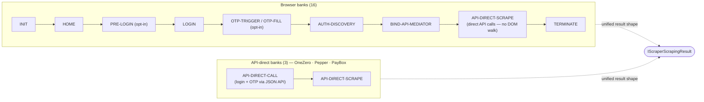

<a id="readme-top"></a>

# Israeli Bank Scrapers

**Scrape transactions from 19 Israeli banks and credit card companies.**
Built-in Cloudflare WAF bypass, automatic OTP handling, and end-to-end PII
redaction — so you can share a failing log without leaking customer data.

```sh
npm install @sergienko4/israeli-bank-scrapers
```

```typescript
import { CompanyTypes, createScraper } from '@sergienko4/israeli-bank-scrapers';

const scraper = createScraper({
  companyId: CompanyTypes.Hapoalim,
  startDate: new Date('2024-01-01'),
});

const result = await scraper.scrape({ userCode: '1234567', password: 'secret' });

if (result.success) {
  for (const account of result.accounts ?? []) {
    console.log(`${account.accountNumber}: ${account.txns.length} txns, balance ${account.balance}`);
  }
}
```

That is the whole API. Every bank uses the same two calls — only the credential
fields differ.

<!-- ALL-CONTRIBUTORS-BADGE:START -->

[](#contributors)

<!-- ALL-CONTRIBUTORS-BADGE:END -->

[](https://www.npmjs.com/package/@sergienko4/israeli-bank-scrapers)
[](https://www.npmjs.com/package/@sergienko4/israeli-bank-scrapers)
[](https://github.com/sergienko4/israeli-bank-scrapers/actions)
[](https://sonarcloud.io/summary/overall?id=sergienko4_israeli-bank-scrapers)
[](https://nodejs.org/)
[](./LICENSE)

> **Documentation** — [User guide](https://sergienko4.github.io/israeli-bank-scrapers/)
> · [API reference](https://sergienko4.github.io/israeli-bank-scrapers/api/)
> · [Changelog](./CHANGELOG.md)
> · [Contributing](./CONTRIBUTING.md)

A maintained fork of [eshaham/israeli-bank-scrapers](https://github.com/eshaham/israeli-bank-scrapers),
rewritten onto a typed phase-based pipeline using
[Camoufox](https://github.com/daijro/camoufox) (Firefox anti-detect),
Playwright, and TypeScript strict mode.

<!-- Regenerate the TOC below with:
     npx doctoc README.md --title '## Table of Contents'
     (doctoc strips comments inside its own markers, so this note lives outside them) -->
<!-- START doctoc generated TOC please keep comment here to allow auto update -->
<!-- DON'T EDIT THIS SECTION, INSTEAD RE-RUN doctoc TO UPDATE -->
## Table of Contents

- [Why this fork](#why-this-fork)
- [Requirements](#requirements)
- [Supported institutions](#supported-institutions)
- [OTP (two-factor authentication)](#otp-two-factor-authentication)
- [What you get back](#what-you-get-back)
- [Handling failures](#handling-failures)
- [How it works](#how-it-works)
- [Documentation](#documentation)
- [Contributing](#contributing)
- [Contributors](#contributors)
- [Built with this library](#built-with-this-library)
- [License](#license)

<!-- END doctoc generated TOC please keep comment here to allow auto update -->

## Why this fork

- **WAF bypass that works on the first attempt** — Camoufox (Firefox
  anti-detect) rather than Puppeteer plus stealth shims.
- **Logins survive UI redesigns** — zero CSS selectors in interaction code.
  Fields are found by the visible Hebrew text a user reads, through a
  7-strategy resolver.
- **PII redaction you can trust** — every log line, captured HTTP body, and DOM
  snapshot passes through one redactor *before* it touches disk.
- **Direct-API scraping after login** — once the browser proves the session,
  data is read from the bank's own REST/GraphQL endpoints, not scraped from the
  DOM. Faster, and immune to layout changes.
- **One result shape** — browser banks and API-direct banks return the same
  `IScraperScrapingResult`.
- **Dual ESM + CJS** — `import` and `require()` both work.

## Requirements

| Requirement | Minimum | Note |
| --- | --- | --- |
| Node.js | `>= 22.14.0` | ESM-by-default + `node:crypto` `randomUUID` |
| npm | `>= 10` | Provenance-signed publishes |
| Disk | ~1.3 GB | Camoufox bundle, cached on **first launch** (not at install) |
| Install scripts | must be allowed | `--ignore-scripts` breaks the native build — see [Troubleshooting](https://sergienko4.github.io/israeli-bank-scrapers/troubleshooting/) |

Windows, macOS, and Linux are all supported.

## Supported institutions

19 institutions. `CompanyTypes.<Name>` selects the bank; credential fields are
validated at runtime.

| Institution | Type | Engine | Credentials |
| --- | --- | --- | --- |
| Bank Hapoalim | Bank | Browser | `userCode`, `password`, OTP\* |
| Bank Leumi | Bank | Browser | `username`, `password` |
| Bank Otsar Hahayal | Bank | Browser | `username`, `password`, OTP |
| Bank Yahav | Bank | Browser | `num`, `nationalID`, `password` |
| Behatsdaa | Bank | Browser | `id`, `password` |
| Beinleumi | Bank | Browser | `username`, `password`, OTP |
| Beyahad Bishvilha | Bank | Browser | `id`, `password` |
| Discount Bank | Bank | Browser | `id`, `password`, `num` |
| Massad | Bank | Browser | `username`, `password`, OTP |
| Mercantile Bank | Bank | Browser | `id`, `password`, `num` |
| Mizrahi Bank | Bank | Browser | `username`, `password` |
| One Zero | Bank | API-direct | `email`, `password`, OTP |
| Pagi | Bank | Browser | `username`, `password`, OTP |
| Pepper (by Leumi) | Bank | API-direct | `phoneNumber`, `password`, OTP |
| Amex | Credit card | Browser | `id`, `card6Digits`, `password` |
| Isracard | Credit card | Browser | `id`, `card6Digits`, `password` |
| Max | Credit card | Browser | `username`, `password` |
| Visa Cal | Credit card | Browser | `username`, `password` |
| PayBox (by Discount) | Wallet | API-direct | `phoneNumber`, OTP |

\* Hapoalim prompts for OTP only on unrecognised devices.

Per-bank notes live in the
[bank documentation](https://sergienko4.github.io/israeli-bank-scrapers/banks/).

> **Legacy path:** Behatsdaa, Beyahad Bishvilha, and Mizrahi Bank still run on
> the pre-pipeline scraper. They work through the same `createScraper(...)`
> entry point and their public behaviour is preserved, but new features target
> the pipeline architecture.

## OTP (two-factor authentication)

**Browser banks** — pass the callback in *options*:

```typescript
createScraper({
  companyId: CompanyTypes.Beinleumi,
  startDate,
  otpCodeRetriever: async phoneHint => await getCodeFromUser(phoneHint),
});
```

**API-direct banks** (OneZero, Pepper, PayBox) — pass it in *credentials*, and
keep the returned token to skip SMS next time:

```typescript
const result = await scraper.scrape({
  email,
  password,
  phoneNumber: '972000000000', // digits only — no '+', no dashes
  otpCodeRetriever: async () => '123456',
});

result.persistentOtpToken; // pass back as `otpLongTermToken` on the next run
```

Pass `phoneNumber` in digits-only international form. Each bank wants a
different wire format (`+972…`, `972…`, `972-…`) and the mediator rewrites it
for you.

## What you get back

```json
{
  "success": true,
  "accounts": [
    {
      "accountNumber": "****1234",
      "balance": 0,
      "txns": [{ "date": "2024-01-15", "description": "<merchant:12>", "chargedAmount": -*** }]
    }
  ]
}
```

This is the **redacted** shape — real balances, amounts, and merchant names are
masked, and account numbers are tail-only. That is what lands in your logs, so
they are safe to share. The values in memory are unredacted.

## Handling failures

```typescript
if (!result.success) {
  console.error(result.errorType, result.errorMessage);
  console.error(result.errorDetails?.suggestions);
}
```

| `errorType` | Meaning |
| --- | --- |
| `INVALID_PASSWORD` | Wrong credentials |
| `INVALID_OTP` | Wrong or expired OTP code |
| `WAF_BLOCKED` | Cloudflare block — read `errorDetails.suggestions` |
| `TIMEOUT` | Page load timeout — raise `defaultTimeout` |
| `TWO_FACTOR_RETRIEVER_MISSING` | OTP required but no callback supplied |
| `GENERIC` | Pipeline phase failure — read `errorMessage` |

Full remedies, including WAF-specific ones, are in
[Troubleshooting](https://sergienko4.github.io/israeli-bank-scrapers/troubleshooting/).

## How it works


```mermaid
flowchart LR
    subgraph BB["Browser banks (16)"]
      direction LR
      INIT --> HOME --> PRELOGIN["PRE-LOGIN (opt-in)"]
      PRELOGIN --> LOGIN
      LOGIN --> OTP["OTP-TRIGGER / OTP-FILL (opt-in)"]
      OTP --> AUTH["AUTH-DISCOVERY"]
      AUTH --> BIND["BIND-API-MEDIATOR"]
      BIND --> SCRAPE["API-DIRECT-SCRAPE<br/>(direct API calls — no DOM walk)"]
      SCRAPE --> TERM["TERMINATE"]
    end

    subgraph API["API-direct banks (3) — OneZero · Pepper · PayBox"]
      direction LR
      CALL["API-DIRECT-CALL<br/>(login + OTP via JSON API)"] --> SCR["API-DIRECT-SCRAPE"]
    end

    BB -.->|"unified result shape"| RESULT(["IScraperScrapingResult"])
    API -.->|"unified result shape"| RESULT
```

Every bank scrapes **direct API after login**. On browser banks, once
`AUTH-DISCOVERY` proves the session, `BIND-API-MEDIATOR` attaches an
authenticated client to the live page and `API-DIRECT-SCRAPE` walks a typed
list of REST/GraphQL calls — no post-login navigation, no DOM scraping. The
API-direct banks reach the same phase through a headless JSON login instead of
the browser prefix.

Phases never read one another's state; they communicate through typed fields on
a shared context. See
[Architecture](https://sergienko4.github.io/israeli-bank-scrapers/architecture/pipeline/).

## Documentation

| Guide | Contents |
| --- | --- |
| [Quick start](https://sergienko4.github.io/israeli-bank-scrapers/quick-start/) | Install, requirements, first scrape |
| [Configuration](https://sergienko4.github.io/israeli-bank-scrapers/configuration/) | Every option, credential, and env var |
| [Troubleshooting](https://sergienko4.github.io/israeli-bank-scrapers/troubleshooting/) | Errors by symptom, WAF remedies |
| [Advanced usage](https://sergienko4.github.io/israeli-bank-scrapers/advanced-usage/) | Parallel scraping, timeouts, upstream migration |
| [Compatibility](https://sergienko4.github.io/israeli-bank-scrapers/compatibility/) | Upgrade notes and breaking changes |
| [Banks](https://sergienko4.github.io/israeli-bank-scrapers/banks/) | Per-bank behaviour and quirks |
| [Architecture](https://sergienko4.github.io/israeli-bank-scrapers/architecture/pipeline/) | Pipeline phases and contracts |
| [PII redaction](https://sergienko4.github.io/israeli-bank-scrapers/observability/redaction/) | What is masked, and how it stays correct |
| [API reference](https://sergienko4.github.io/israeli-bank-scrapers/api/) | Generated TypeDoc |

Upgrading? [Compatibility](https://sergienko4.github.io/israeli-bank-scrapers/compatibility/)
lists the releases that need action; everything else is a drop-in. Full
per-release detail is in the [changelog](./CHANGELOG.md).

## Contributing

Bug reports and pull requests are welcome — see
[CONTRIBUTING.md](./CONTRIBUTING.md) for the workflow and branch strategy.

Before opening a PR:

```sh
npm run test:unit       # unit tests
npm run lint            # eslint + architecture + canaries + format
npm run test:pipeline   # coverage gates (97/95/97/98)
```

The pre-commit hook runs those plus mocked E2E. PRs are squash-merged and
release-please cuts the next version automatically.

**Filing a bug?** Attach `pipeline.log`, `network/*.json`, and
`screenshots/*.html` — all three are redacted at write time and safe to share.
Skip the `.png` files; raster images are not OCR-scrubbed.

## Contributors

Thanks to the original [israeli-bank-scrapers](https://github.com/eshaham/israeli-bank-scrapers)
contributors, whose work this fork builds on:

<!-- ALL-CONTRIBUTORS-LIST:START -->
<!-- prettier-ignore-start -->
<!-- markdownlint-disable -->
<table>
  <tbody>
    <tr>
      <td align="center" valign="top" width="14.28%"><a href="https://github.com/sergienko4"><br /><sub><b>sergienko4 Eugune</b></sub></a><br /><a href="https://github.com/sergienko4/israeli-bank-scrapers/commits?author=sergienko4" title="Code">💻</a> <a href="https://github.com/sergienko4/israeli-bank-scrapers/commits?author=sergienko4" title="Documentation">📖</a> <a href="https://github.com/sergienko4/israeli-bank-scrapers/commits?author=sergienko4" title="Tests">⚠️</a> <a href="#maintenance-sergienko4" title="Maintenance">🚧</a> <a href="#infra-sergienko4" title="Infrastructure (Hosting, Build-Tools, etc)">🚇</a></td>
      <td align="center" valign="top" width="14.28%"><a href="http://elad.shaham.net/"><br /><sub><b>Elad Shaham</b></sub></a><br /><a href="https://github.com/sergienko4/israeli-bank-scrapers/commits?author=eshaham" title="Code">💻</a></td>
      <td align="center" valign="top" width="14.28%"><a href="https://github.com/sebikaplun"><br /><sub><b>sebikaplun</b></sub></a><br /><a href="https://github.com/sergienko4/israeli-bank-scrapers/commits?author=sebikaplun" title="Code">💻</a></td>
      <td align="center" valign="top" width="14.28%"><a href="https://github.com/esakal"><br /><sub><b>esakal</b></sub></a><br /><a href="https://github.com/sergienko4/israeli-bank-scrapers/commits?author=esakal" title="Code">💻</a></td>
      <td align="center" valign="top" width="14.28%"><a href="https://github.com/ezzatq"><br /><sub><b>ezzatq</b></sub></a><br /><a href="https://github.com/sergienko4/israeli-bank-scrapers/commits?author=ezzatq" title="Code">💻</a></td>
      <td align="center" valign="top" width="14.28%"><a href="https://github.com/kfirarad"><br /><sub><b>kfirarad</b></sub></a><br /><a href="https://github.com/sergienko4/israeli-bank-scrapers/commits?author=kfirarad" title="Code">💻</a></td>
      <td align="center" valign="top" width="14.28%"><a href="https://github.com/baruchiro"><br /><sub><b>baruchiro</b></sub></a><br /><a href="https://github.com/sergienko4/israeli-bank-scrapers/commits?author=baruchiro" title="Code">💻</a></td>
    </tr>
    <tr>
      <td align="center" valign="top" width="14.28%"><a href="https://github.com/matanelgabsi"><br /><sub><b>matanelgabsi</b></sub></a><br /><a href="https://github.com/sergienko4/israeli-bank-scrapers/commits?author=matanelgabsi" title="Code">💻</a></td>
      <td align="center" valign="top" width="14.28%"><a href="https://github.com/dratler"><br /><sub><b>dratler</b></sub></a><br /><a href="https://github.com/sergienko4/israeli-bank-scrapers/commits?author=dratler" title="Code">💻</a></td>
      <td align="center" valign="top" width="14.28%"><a href="https://github.com/dudiventura"><br /><sub><b>dudiventura</b></sub></a><br /><a href="https://github.com/sergienko4/israeli-bank-scrapers/commits?author=dudiventura" title="Code">💻</a></td>
      <td align="center" valign="top" width="14.28%"><a href="https://github.com/gczobel"><br /><sub><b>gczobel</b></sub></a><br /><a href="https://github.com/sergienko4/israeli-bank-scrapers/commits?author=gczobel" title="Code">💻</a></td>
      <td align="center" valign="top" width="14.28%"><a href="https://github.com/orzarchi"><br /><sub><b>orzarchi</b></sub></a><br /><a href="https://github.com/sergienko4/israeli-bank-scrapers/commits?author=orzarchi" title="Code">💻</a></td>
      <td align="center" valign="top" width="14.28%"><a href="https://github.com/erezd"><br /><sub><b>erezd</b></sub></a><br /><a href="https://github.com/sergienko4/israeli-bank-scrapers/commits?author=erezd" title="Code">💻</a></td>
      <td align="center" valign="top" width="14.28%"><a href="https://github.com/erikash"><br /><sub><b>erikash</b></sub></a><br /><a href="https://github.com/sergienko4/israeli-bank-scrapers/commits?author=erikash" title="Code">💻</a></td>
    </tr>
    <tr>
      <td align="center" valign="top" width="14.28%"><a href="https://github.com/daniel-hauser"><br /><sub><b>daniel-hauser</b></sub></a><br /><a href="https://github.com/sergienko4/israeli-bank-scrapers/commits?author=daniel-hauser" title="Code">💻</a></td>
    </tr>
  </tbody>
</table>

<!-- markdownlint-restore -->
<!-- prettier-ignore-end -->

<!-- ALL-CONTRIBUTORS-LIST:END -->

## Built with this library

- [israeli-bank-scrapers-to-actual-budget](https://github.com/sergienko4/israeli-bank-scrapers-to-actual-budget) — sync to Actual Budget
- [Caspion](https://github.com/brafdlog/caspion) — auto-send to budget apps
- [Moneyman](https://github.com/daniel-hauser/moneyman) — save via GitHub Actions
- [Firefly III Importer](https://github.com/itairaz1/israeli-bank-firefly-importer) — import to Firefly III

## License

MIT. Maintained by [@sergienko4](https://github.com/sergienko4), based on
[eshaham/israeli-bank-scrapers](https://github.com/eshaham/israeli-bank-scrapers).

[Code of Conduct](./CODE_OF_CONDUCT.md) · [Security Policy](./SECURITY.md)
