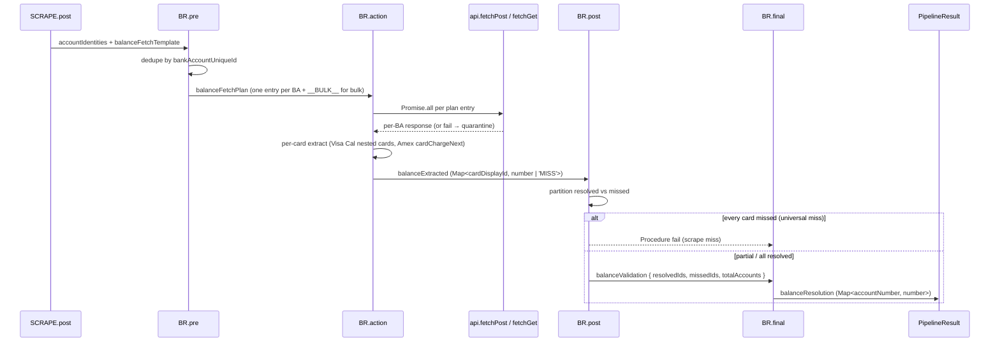

# BALANCE-RESOLVE (v6) — single-phase balance ownership

> **Lands in v8.4.0** (commit `c267d48b`). The architectural shift that **closes the v4 "universal-empty" gate** and removes ~370 LOC of v5 attribution code from SCRAPE.

## What changed

| | v5 (before) | v6 (now) |
|---|---|---|
| Who fetches balance? | SCRAPE attributed per-account responses from the captured pool | **BALANCE-RESOLVE** issues live `api.fetchPost` / `fetchGet` calls |
| Where does the per-card extractor live? | `Strategy/Scrape/Account/BalanceExtractor.ts` | `Mediator/BalanceResolve/BalanceExtractor.ts` |
| What does SCRAPE.post emit? | `perAccountResponses` (a partial Pool with attribution heuristics) | `accountIdentities` (`cardDisplayId + cardUniqueId + bankAccountUniqueId` triples) + `balanceFetchTemplate` (URL + method + body key) |
| Universal-empty result | "scrape failed" (`Procedure fail`) — ate legitimate empty months | **Pass-through** — only fails if BALANCE-RESOLVE hard-fails on universal MISS |

## Sub-step contract

### `.pre` — build the plan

Reads `scrape.accountIdentities` + `scrape.balanceFetchTemplate`. **Default-deny** when either is absent — returns `Procedure fail`. Emits `balanceFetchPlan`:

| Template kind | Plan output |
|---|---|
| POST + `postBodyKey` | One entry per unique `bankAccountUniqueId`, body = `{ [postBodyKey]: id }` |
| GET + `urlQueryKey` | One entry per unique BA, `?<urlQueryKey>=<id>` substituted |
| GET + `urlPathInterpolation` | One entry per unique BA, `<ID>` replaced in URL path |
| Bulk (no key) | One entry with `bankAccountUniqueId: '__BULK__'` covering every card |

Source: [`BalanceFetchPlanner.ts`](https://github.com/sergienko4/israeli-bank-scrapers/blob/{{BRANCH}}/src/Scrapers/Pipeline/Mediator/BalanceResolve/BalanceFetchPlanner.ts).

### `.action` — fetch + extract

- Dispatches all plan entries under one `Promise.all` for concurrency.
- **Quarantine pattern**: per-fetch failures emit `balance-resolve.fetch.failure` (warn) and produce `'MISS'` for the affected bank account. Other accounts continue.
- Per-card extraction handles three shapes:
    - Single-account banks (Hapoalim, Discount, Beinleumi) — straight body extraction.
    - Per-card-record banks (Visa Cal — `result.bigNumbers[].cards[]`, Amex/Isracard — `data.cardsList[].cardChargeNext.billingSumSekel`) — find the card by `cardUniqueId` or one of the display-id fields (`last4Digits`, `cardSuffix`, `cardLast4`, `shortCardNumber`, `card4Number`), then run the bulk extractor on its sub-record.
    - Bulk endpoints — `responses.get('__BULK__')` services every card via the same body.

Source: [`BalanceResolveActions.ts`](https://github.com/sergienko4/israeli-bank-scrapers/blob/{{BRANCH}}/src/Scrapers/Pipeline/Mediator/BalanceResolve/BalanceResolveActions.ts) (`executeBalanceResolveAction`).

### `.post` — partition + universal-miss gate

| Condition | Outcome |
|---|---|
| `totalAccounts === 0` | succeed (no work to validate) |
| `missedIds.length === totalAccounts && totalAccounts > 0` | `Procedure fail` — universal MISS = real scrape failure |
| Otherwise | succeed; emit per-account `balance.miss` warn for each missed card |

### `.final` — emit `balanceResolution`

Builds `Map<accountNumber, number>` (legitimate `0` preserved; `'MISS'` → `0`). Writes to `ctx.balanceResolution` which [`PipelineResult`](https://github.com/sergienko4/israeli-bank-scrapers/blob/{{BRANCH}}/src/Scrapers/Pipeline/Core/PipelineResult.ts) reads when assembling the final accounts array.

## Balance-kind scoping (R1 hardening)

Every bank config declares a mandatory `balanceKind` — a `BalanceKind` of either `account` or `card-cycle` (the canonical constants `ACCOUNT_KIND` and `CARD_CYCLE_KIND`). The declared kind scopes balance discovery to **one** alias family, so a card bank can never resolve an incidental account-style field and an account bank never a card-cycle debit total.

| Kind | Constant | Alias family | Example aliases |
|---|---|---|---|
| `account` | `ACCOUNT_KIND` | `ACCOUNT_BALANCE_FAMILY` | `AccountBalance`, `currentBalance`, `runningBalance` |
| `card-cycle` | `CARD_CYCLE_KIND` | `CARD_CYCLE_BALANCE_FAMILY` | `nextTotalDebit`, `totalDebit`, `billingSumSekel` |

The two families are **disjoint** and together partition the full WK balance-alias surface. `scopeAliasesByKind(aliases, kind)` is the single filter both seams share — it returns the order-preserving **subset** of `aliases` that belongs to the kind's family, never adding an alias the base list lacked (a behaviour-preserving restriction, not a new lookup).

Two seams consume it, one per balance path — each pairs a kind-scoped alias resolver with its extractor entry point:

| Seam | Kind-scoped resolver | Extractor entry |
|---|---|---|
| BALANCE-RESOLVE (primary, live fetch) | `scopedResolveBalanceAliases(kind)` | `runBalanceExtractorWith(body, aliases)` |
| SCRAPE → DASHBOARD.FINAL (txn field-map) | `scopedTxnBalanceAliases(kind)` | `resolveFieldMapOrEmpty` |

Source: [`BalanceKind.ts`](https://github.com/sergienko4/israeli-bank-scrapers/blob/{{BRANCH}}/src/Scrapers/Pipeline/Registry/WK/BalanceKind.ts), [`BalanceResolveWK.ts`](https://github.com/sergienko4/israeli-bank-scrapers/blob/{{BRANCH}}/src/Scrapers/Pipeline/Registry/WK/BalanceResolveWK.ts), [`EndpointFieldMap.ts`](https://github.com/sergienko4/israeli-bank-scrapers/blob/{{BRANCH}}/src/Scrapers/Pipeline/Mediator/Scrape/EndpointResolver/EndpointFieldMap.ts).

## Observability

| Event | Level | When |
|---|---|---|
| `balance-resolve.fetch.start` | info | Before each live fetch (one per plan entry) |
| `balance-resolve.fetch.success` | info | Successful response |
| `balance-resolve.fetch.failure` | warn | Quarantined per-fetch failure |
| `balance-resolve.post resolved=N missed=M total=K` | debug | At `.post` partition |
| `balance.miss account=*** message=...` | warn | One per missed account |
| `balance-resolve.final` | info | REVEAL log at `.final` |

Every event carries `correlationId: randomUUID()` (one per phase invocation) + `bankAccountTail4: maskTail4(bankAccountUniqueId)` (last-4 of the BA, never the full id). See [Observability → Structured events](../observability/events.md) for the redaction guarantee.

## Lint enforcement

Three ESLint canaries lock the boundary at commit time:

| Canary | What it rejects |
|---|---|
| [`balance-resolve-isolation.canary.ts`](https://github.com/sergienko4/israeli-bank-scrapers/blob/{{BRANCH}}/src/Scrapers/Pipeline/EslintCanaries/balance-resolve-isolation.canary.ts) | BALANCE-RESOLVE code reaching outside its own folder |
| [`no-balance-in-scrape.canary.ts`](https://github.com/sergienko4/israeli-bank-scrapers/blob/{{BRANCH}}/src/Scrapers/Pipeline/EslintCanaries/no-balance-in-scrape.canary.ts) | SCRAPE-zone code importing balance extractor / planner |
| [`balance-fetch-only-in-balance-resolve.canary.ts`](https://github.com/sergienko4/israeli-bank-scrapers/blob/{{BRANCH}}/src/Scrapers/Pipeline/EslintCanaries/balance-fetch-only-in-balance-resolve.canary.ts) | `BalanceFetchPlanner` imported anywhere outside `BalanceResolve/` |

A PR that violates any of the three fails the **`canaries`** gate of the pre-commit hook (and the build CI gate).

## Test coverage

| File | Tests |
|---|---|
| [`BalanceResolveActionsV6.test.ts`](https://github.com/sergienko4/israeli-bank-scrapers/blob/{{BRANCH}}/src/Tests/Unit/Pipeline/Mediator/BalanceResolve/BalanceResolveActionsV6.test.ts) | Happy path: PRE → ACTION → POST → FINAL per shape (single, per-BA, bulk) |
| [`BalanceFetchPlanner.test.ts`](https://github.com/sergienko4/israeli-bank-scrapers/blob/{{BRANCH}}/src/Tests/Unit/Pipeline/Mediator/BalanceResolve/BalanceFetchPlanner.test.ts) | Planner dedup, default-deny, malformed URL |
| [`BalanceResolveActionsCoverage.test.ts`](https://github.com/sergienko4/israeli-bank-scrapers/blob/{{BRANCH}}/src/Tests/Unit/Pipeline/Mediator/BalanceResolve/BalanceResolveActionsCoverage.test.ts) | Edge branches: null/array/primitive POST body, malformed JSON, extractor-false fall-through |
| [`BalanceResolveCrossBank.test.ts`](https://github.com/sergienko4/israeli-bank-scrapers/blob/{{BRANCH}}/src/Tests/Unit/Pipeline/Mediator/BalanceResolve/BalanceResolveCrossBank.test.ts) | Per-shape cross-bank smoke (Hapoalim / Visa Cal / Amex) |
| [`BalanceResolvePhase.test.ts`](https://github.com/sergienko4/israeli-bank-scrapers/blob/{{BRANCH}}/src/Tests/Unit/Pipeline/Phases/BalanceResolvePhase.test.ts) | Phase orchestrator delegates to the right action |
| [`BalanceExtractor.test.ts`](https://github.com/sergienko4/israeli-bank-scrapers/blob/{{BRANCH}}/src/Tests/Unit/Pipeline/Mediator/BalanceResolve/BalanceExtractor.test.ts) | BFS+ILS depth-5 extractor against every bank shape |
