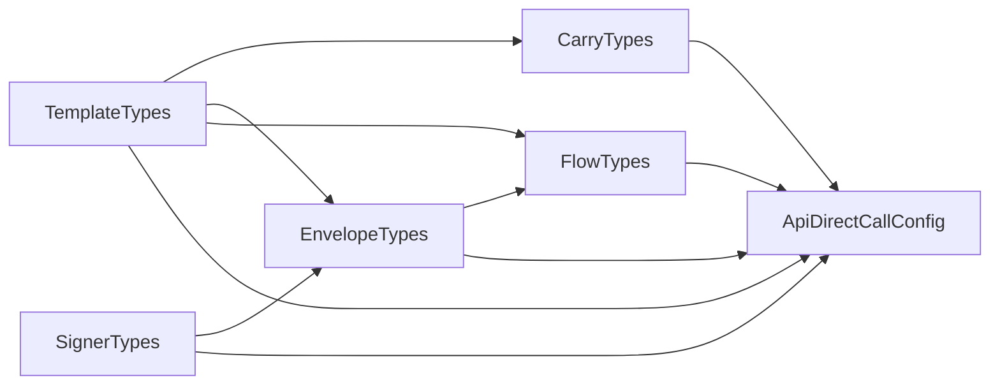

# Config Contracts (API-DIRECT-CALL)

> **Who this is for:** developers wiring a new API-direct bank, or auditing
> the type surface that powers the [API-DIRECT-CALL phase](../phases/api-direct-call.md).

The API-DIRECT-CALL config contract is the typed shape every API-direct bank
(Pepper, PayBox, OneZero) compiles its `PipelineBankConfig.headless` literal
against. As of **v8.5** that shape lives in **six focused concern-slice files**
under `src/Scrapers/Pipeline/Mediator/ApiDirectCall/ConfigContracts/`, exported
through a single barrel. The legacy `IApiDirectCallConfig.ts` file is now a
**14-line deprecated re-export shim** scheduled for removal in **v8.6**.

## File layout

```
src/Scrapers/Pipeline/Mediator/ApiDirectCall/
├── ConfigContracts/
│   ├── index.ts              ← barrel re-export (wide-import surface)
│   ├── TemplateTypes.ts      ← root bucket — no intra-cluster deps
│   ├── SignerTypes.ts        ← root bucket — no intra-cluster deps
│   ├── CarryTypes.ts         ← deps TemplateTypes
│   ├── EnvelopeTypes.ts      ← deps TemplateTypes + SignerTypes
│   ├── FlowTypes.ts          ← deps TemplateTypes + EnvelopeTypes
│   └── ApiDirectCallConfig.ts ← composes all five
└── IApiDirectCallConfig.ts   ← @deprecated shim (re-exports the barrel)
```

The dependency graph is **acyclic** (`madge --circular` is part of the lint
ladder and reports zero cycles after every commit):



`TemplateTypes` and `SignerTypes` are independent roots; every other bucket
depends on `TemplateTypes`; only `EnvelopeTypes` and `ApiDirectCallConfig`
depend on `SignerTypes`.

## What each bucket owns

Each row lists the exact named exports of the sub-module (verified against
the source); the dependency column lists the ConfigContracts buckets it imports
from (cross-package imports such as `Registry/WK/*` are omitted for brevity).

| Bucket | Exports | Intra-cluster deps |
|---|---|---|
| **TemplateTypes** | `RefToken`, `JsonValueTemplate`, `IBodyTemplate`, `IEnvelopeSelectors` | (none) |
| **SignerTypes** | `SignerAlgorithm`, `AsymmetricSignerAlgorithm`, `SignerEncoding`, `CanonicalPart`, `ICanonicalStringConfig`, `IAsymmetricSignerConfig`, `IAesSignerConfig`, `ISignerConfig`, `ICryptoFieldConfig` | (none) |
| **CarryTypes** | `IWarmStartConfig`, `ISeedCarrySource`, `IRandomHex16Bootstrap`, `ISha256Prefix16Bootstrap`, `IJwtClaimBootstrap`, `SeedCarryBootstrapKind`, `IDerivedCarry` | TemplateTypes |
| **EnvelopeTypes** | `IFingerprintConfig`, `AuthScheme`, `IJwtClaimsConfig`, `IProbeConfig`, `IPreStepHook` | TemplateTypes, SignerTypes |
| **FlowTypes** | `FlowKind`, `StepName`, `IStepConfig` | TemplateTypes, EnvelopeTypes |
| **ApiDirectCallConfig** | `IApiDirectCallConfig` | all five above |

Notes:

- `ICryptoFieldConfig` is owned by `SignerTypes` (it describes a crypto-signing
  side-effect on the outbound body) and is consumed by `EnvelopeTypes` via
  `IPreStepHook.cryptoField`.
- `IPreStepHook` is owned by `EnvelopeTypes`; `FlowTypes.IStepConfig.preHook`
  references it.

Every file is **≤ 150 effective LoC** (current max: `CarryTypes.ts` at 109)
and is held there by an ESLint guard (`eslint.config.mjs` §14) plus a
canary fixture (`EslintCanaries/no-api-direct-call-blob.canary.ts`).

## Import patterns

### Wide-import (preferred when a call-site touches multiple buckets)

```ts
import type {
  IApiDirectCallConfig,
  ISignerConfig,
  IStepConfig,
} from '<rel>/Mediator/ApiDirectCall/ConfigContracts/index.js';
```

### Narrow per-bucket (preferred for surgical imports)

```ts
import type { ISignerConfig } from '<rel>/Mediator/ApiDirectCall/ConfigContracts/SignerTypes.js';
import type { IWarmStartConfig } from '<rel>/Mediator/ApiDirectCall/ConfigContracts/CarryTypes.js';
import type { IStepConfig, FlowKind } from '<rel>/Mediator/ApiDirectCall/ConfigContracts/FlowTypes.js';
```

### Legacy (`@deprecated`, slated for removal in v8.6)

```ts
// Historical importers still resolve through this shim, which re-exports
// the full barrel. New code MUST use the patterns above. The shim carries
// an IDE/language-service `@deprecated` signal so call-sites surface the
// warning in editors that honour the JSDoc tag.
import type { IApiDirectCallConfig } from '<rel>/Mediator/ApiDirectCall/IApiDirectCallConfig.js';
```

## Why the split

The pre-v8.5 `IApiDirectCallConfig.ts` had grown to **369 LoC** as
Pepper/PayBox/OneZero accreted concerns over four phases — well above the
canonical **150 LoC** file ceiling enforced everywhere else under
`src/Scrapers/Pipeline/`. The split:

1. **Eliminates the type-sink hotspot.** Each new bank now imports
   only the buckets it actually touches; the fan-in is concentrated
   on `TemplateTypes` (universally used) rather than spread across
   one god-file that pulled every consumer through every change.
2. **Enforces SRP at the type layer.** ESLint `max-lines: 150` + a
   canary fixture prevent silent regrowth. `lint:guideline-coverage`
   tracks `ConfigContracts/**/*.ts` as the **4th** cluster
   (after `PiiRedactor`) with the canonical per-cluster profile
   (file 150 / per-fn 10 / complexity 10 / params 3).
3. **Preserves the public surface.** `lib/index.cjs` is
   **byte-identical** pre- and post-split — the barrel re-export
   keeps every existing name, every existing path through
   `IApiDirectCallConfig.ts` still resolves, and every historical
   importer compiles unchanged.

## Removal timeline (v8.6)

The `IApiDirectCallConfig.ts` shim ships with a `@deprecated` JSDoc tag in
v8.5; IDEs and the TypeScript language service surface a deprecation
indication at every import site. The removal sweep in v8.6 will:

- Rewrite each historical `IApiDirectCallConfig.ts` import to either the
  barrel (`ConfigContracts/index.js`) or the narrow per-bucket form.
- Delete `IApiDirectCallConfig.ts`.
- Confirm `lib/index.cjs` remains byte-identical (only import paths in
  the type-tree change — no public name is removed).

See the master plan at `phase-8.5-canonical-10/` for the canonical-10
sweep that lands alongside the shim removal.

## Related

- [API-DIRECT-CALL phase](../phases/api-direct-call.md) — runtime usage
  of these types
- [Pipeline architecture](pipeline.md) — overall phase model
- [Layer separation](layers.md) — where ConfigContracts sits in the layer
  graph (`types` layer, sub-cluster `pipeline-types`)
