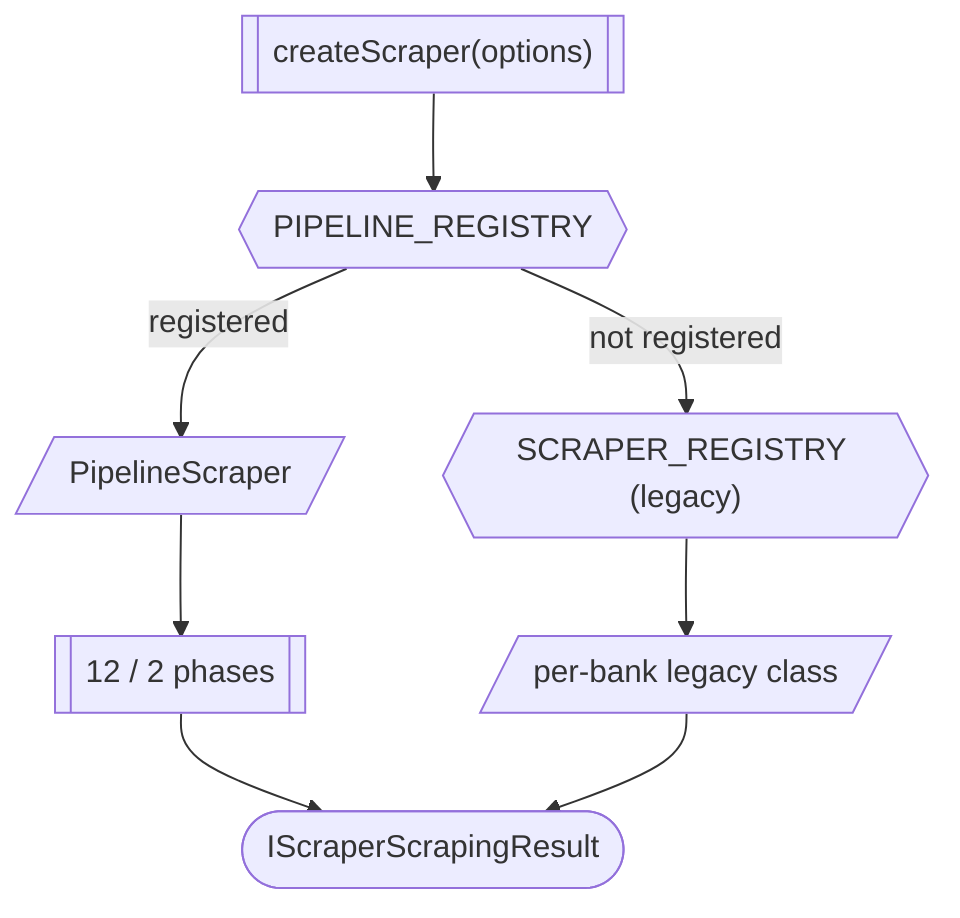

# Architecture

> **Who this is for:** developers building on, extending, or auditing the codebase.

The package is a **typed phase-based pipeline**. Banks register a declarative `PipelineDescriptor` and the executor drives the phases in order. Phases never reach into each other — communication happens via slim `Option<T>` fields on the shared `IPipelineContext`.

## Read in this order

1. **[Pipeline architecture](pipeline.md)** — the 12 browser phases + 2 api-direct phases, the `IPipelineContext`, the `Procedure<T>` result pattern.
2. **[Layer separation](layers.md)** — the 9 logical layers (public-api, orchestration, mediator, strategy-registry, types, legacy-scrapers, common-utilities, tests, build-ci) and how imports flow between them.
3. **[Config Contracts (api-direct-call)](config-contracts.md)** — the 6-bucket type split that replaces the legacy `IApiDirectCallConfig.ts` god-file in v8.5; the example that defines how every type-tree should be carved into ≤150-LoC concern slices.
4. **[BALANCE-RESOLVE (v6)](balance-resolve.md)** — the single-phase ownership rewrite that lands in v8.4; the example that defines how new phases should be structured.
5. **[Legacy (deprecated)](legacy.md)** — what counts as legacy under the wide-net policy, why it still ships, and what to read instead.
6. **[Migration strategy](migration.md)** — how legacy code folds into Pipeline; staging plan.

## At a glance

## Anchor invariants

| Invariant | Where enforced |
|---|---|
| Phases own state — no cross-phase reach | `IPipelineContext` is read-only between phases; lint canary `balance-resolve-isolation` |
| No CSS selectors in interaction code | ESLint AST rules + `SelectorResolver` is the only entry point |
| No raw PII in logs / captures / snapshots | `PiiRedactor` runs as Pino's `redact.censor` + ESLint `PII-Log` rule |
| No `null` / `undefined` returns from functions | ESLint `no-restricted-syntax` on return types |
| Pipeline-first dispatch in public entry | `createScraper` tries `PIPELINE_REGISTRY` before falling back |

## Source pointers

| File | Role |
|---|---|
| [`src/Scrapers/Pipeline/Core/Builder/PipelineAssembly.ts`](https://github.com/sergienko4/israeli-bank-scrapers/blob/{{BRANCH}}/src/Scrapers/Pipeline/Core/Builder/PipelineAssembly.ts) | Declarative `PHASE_CHAIN` slot definitions |
| [`src/Scrapers/Pipeline/Banks/PipelineRegistry.ts`](https://github.com/sergienko4/israeli-bank-scrapers/blob/{{BRANCH}}/src/Scrapers/Pipeline/Banks/PipelineRegistry.ts) | Merges the alphabetical-half sub-registries into `PIPELINE_REGISTRY` (`CompanyTypes → PipelineFactory`); Core stays bank-agnostic |
| [`src/Scrapers/Pipeline/Types/PipelineContext.ts`](https://github.com/sergienko4/israeli-bank-scrapers/blob/{{BRANCH}}/src/Scrapers/Pipeline/Types/PipelineContext.ts) | All shared types + `Option<T>` slots |
| [`src/Scrapers/Pipeline/Types/Procedure.ts`](https://github.com/sergienko4/israeli-bank-scrapers/blob/{{BRANCH}}/src/Scrapers/Pipeline/Types/Procedure.ts) | The `Procedure<T>` result-pattern primitive |
