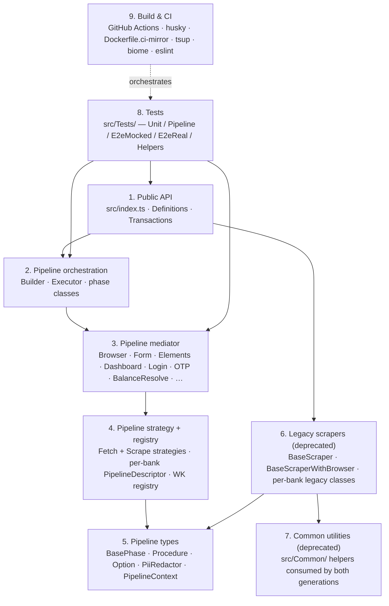

# Layer separation

The codebase is organised into **9 logical layers** (per the `/understand` knowledge-graph analysis). Every file belongs to exactly one. Imports flow downward — a higher layer may import from a lower one, never the reverse.

## Layer details

| #   | Layer                        | Path                                                                                                                                                                                                                                                               | Status                                                |
| --- | ---------------------------- | ------------------------------------------------------------------------------------------------------------------------------------------------------------------------------------------------------------------------------------------------------------------ | ----------------------------------------------------- |
| 1   | Public API                   | `src/index.ts`, `src/Definitions.ts`, `src/Transactions.ts`, `src/Scrapers/Registry/Factory.ts`                                                                                                                                                                    | Stable                                                |
| 2   | Pipeline orchestration       | `src/Scrapers/Pipeline/Core/`, `src/Scrapers/Pipeline/Phases/`, `src/Scrapers/Pipeline/Interceptors/`                                                                                                                                                              | Canonical                                             |
| 3   | Pipeline mediator            | `src/Scrapers/Pipeline/Mediator/` (BalanceResolve, Browser, Dashboard, Elements, Form, Login, Network, OtpFill, OtpTrigger, Scrape, …)                                                                                                                             | Canonical                                             |
| 4   | Pipeline strategy + registry | `src/Scrapers/Pipeline/Strategy/`, `src/Scrapers/Pipeline/Banks/`, `src/Scrapers/Pipeline/Registry/`, `src/Scrapers/Registry/Factory.ts`                                                                                                                           | Canonical                                             |
| 5   | Pipeline types               | `src/Scrapers/Pipeline/Types/`, `src/Scrapers/Base/{Interface, ErrorTypes, ScraperError, Config/, Interfaces/}`                                                                                                                                                    | Shared infra                                          |
| 6   | Legacy scrapers              | `src/Scrapers/Base/{BaseScraper, BaseScraperWithBrowser, BaseScraperHelpers, ConcreteGenericScraper, GenericBankScraper}.ts`, `src/Scrapers/{Behatsdaa, BeyahadBishvilha, Leumi, Mizrahi}/`, `src/Scrapers/Registry/ScraperRegistryLeumiToYahav.ts` (Mizrahi only) | **Deprecated**                                        |
| 7   | Common utilities             | `src/Common/` (Browser, CamoufoxLauncher, Fetch, Navigation, OtpDetector, OtpHandler, ResultFormatter, SafeScreenshot, SelectorResolver, Storage, Waiting, …)                                                                                                      | **Mostly deprecated** — pipeline uses only `Debug.ts` |
| 8   | Tests                        | `src/Tests/Unit/`, `src/Tests/E2eMocked/`, `src/Tests/E2eReal/`, `src/Tests/Helpers/`, `src/Tests/Tools/`                                                                                                                                                          | Always-on gate                                        |
| 9   | Build & CI                   | `.github/workflows/`, `.husky/`, `tsup.config.ts`, `biome.json`, `eslint.config.mjs`, `tsconfig.json`                                                                                                                                                              | Always-on gate                                        |

## What lives in layer 5 vs layer 6

**Layer 5 (shared infra — used by Pipeline 107 times)** keeps shipping unchanged:

- `src/Scrapers/Base/Interface.ts` — `IScraper`, `IScraperScrapingResult`, `ScraperOptions`, `ScraperCredentials`
- `src/Scrapers/Base/ErrorTypes.ts` — `ScraperErrorTypes` enum
- `src/Scrapers/Base/ScraperError.ts` — error class
- `src/Scrapers/Base/Config/LoginConfig*.ts` — declarative login config types
- `src/Scrapers/Base/Interfaces/**` — all sub-interfaces

**Layer 6 (legacy)** still works through `createScraper` but is on the migration path:

- The 4 legacy bank dirs (Behatsdaa, BeyahadBishvilha, Leumi, Mizrahi) — Yahav migrated to Pipeline
- The 5 legacy base classes (`BaseScraper`, `BaseScraperWithBrowser`, `BaseScraperHelpers`, `ConcreteGenericScraper`, `GenericBankScraper`)
- The legacy registry (`ScraperRegistryLeumiToYahav.ts`)

## Import direction enforcement

The architecture validator (`lint:architecture`) runs on every commit and rejects:

- Imports from `src/Scrapers/Pipeline/` into `src/Common/` or `src/Scrapers/Base/{BaseScraper*, ConcreteGenericScraper}`
- Imports from layer 1 (Public API) into any legacy implementation
- Cross-mediator imports within layer 3 (BALANCE-RESOLVE cannot reach into SCRAPE state directly)

Source: [`src/Tests/Tools/lint-and-validate.ts`](https://github.com/sergienko4/israeli-bank-scrapers/blob/{{BRANCH}}/src/Tests/Tools/lint-and-validate.ts) + the 3 architecture canaries under `src/Scrapers/Pipeline/EslintCanaries/`.
