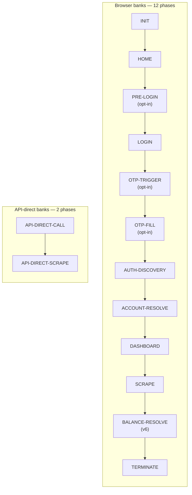

# Pipeline architecture

The pipeline is a **declarative chain of typed phases** orchestrated by `PipelineExecutor`. Each phase implements `BasePhase` and owns four sub-step hooks: `pre`, `action`, `post`, `final`. The executor drives them in order, threading an immutable `IPipelineContext` snapshot between phases.

## The 12 + 2 phases



| Slot | Phase | Always-on? | Owner concern |
|---|---|---|---|
| 1 | [INIT](../phases/init.md) | ✅ browser | Launch Camoufox, build the `IPipelineContext`, navigate to bank URL |
| 2 | [HOME](../phases/home.md) | ✅ browser | Landing-page discovery, signal login readiness |
| 3 | [PRE-LOGIN](../phases/pre-login.md) | ⚙️ opt-in | Card banks with a "show login" toggle (Amex, Isracard, Max, VisaCal) |
| 4 | [LOGIN](../phases/login.md) | ✅ browser | 7-strategy `SelectorResolver` + declarative `LoginConfig` |
| 5 | [OTP-TRIGGER](../phases/otp-trigger.md) | ⚙️ opt-in | Ask bank to dispatch SMS (Beinleumi-group, Hapoalim conditional) |
| 6 | [OTP-FILL](../phases/otp-fill.md) | ⚙️ opt-in | Fill the code returned by `otpCodeRetriever` |
| 7 | [AUTH-DISCOVERY](../phases/auth-discovery.md) | ✅ browser | Capture post-login auth token + API origin from network |
| 8 | [ACCOUNT-RESOLVE](../phases/account-resolve.md) | ✅ browser | Discover account/card list + billing-cycle catalog |
| 9 | [DASHBOARD](../phases/dashboard.md) | ✅ browser | Pivot to dashboard, prime network capture pool |
| 10 | [SCRAPE](../phases/scrape.md) | ✅ all | Per-account transaction walk; emits `accountIdentities` + `balanceFetchTemplate` |
| 11 | [BALANCE-RESOLVE](../phases/balance-resolve.md) | ✅ browser | **New in v6** — owns every live balance fetch + per-card extraction |
| 12 | [TERMINATE](../phases/terminate.md) | ✅ browser | Close page/context/browser, finalise `IScraperScrapingResult` |
| — | [API-DIRECT-CALL](../phases/api-direct-call.md) | api-direct only | Replaces INIT…OTP-FILL for OneZero/Pepper/PayBox |
| — | [API-DIRECT-SCRAPE](../phases/api-direct-scrape.md) | api-direct only | Replaces SCRAPE+BALANCE-RESOLVE; `.final` emits `ctx.balanceResolution` |

## The Procedure result pattern

Every action returns `Procedure<T> = { success: true, value: T } | { success: false, errorType, errorMessage }`. Phases never throw exceptions across boundaries; they return Procedures and the executor consults `.success` to decide whether to advance.

```typescript
type Procedure<T> =
  | { readonly success: true; readonly value: T }
  | { readonly success: false; readonly errorType: ScraperErrorTypes; readonly errorMessage: string };
```

| Helper | Use |
|---|---|
| `succeed(value)` | Build the success branch |
| `fail(type, msg)` | Build the failure branch |
| `isOk(p)` | Boolean type-guard |
| `toLegacy(p)` | Convert to the public `IScraperScrapingResult` shape |
| `assertOk(p)` | Test-only — `expect(p.success).toBe(true)` + type narrowing |

See [`Procedure.ts`](https://github.com/sergienko4/israeli-bank-scrapers/blob/{{BRANCH}}/src/Scrapers/Pipeline/Types/Procedure.ts).

## IPipelineContext — the shared state slot table

`IPipelineContext` is a discriminated record of `Option<T>` slots. Each phase reads the slots its `pre`/`action`/`post`/`final` declare, and writes only the slots it owns. The compiler enforces that no phase writes outside its declared scope.

Key slots (v8.4+):

| Slot | Owner | Purpose |
|---|---|---|
| `browser` | INIT | Playwright browser + context + page |
| `login` | LOGIN | `persistentOtpToken`, `urlBeforeSubmit` |
| `accountDiscovery` | ACCOUNT-RESOLVE | `ids`, `records`, `billingCycleCatalog` |
| `txnEndpoint` | DASHBOARD.final | Slim `ITxnEndpoint` consumed by SCRAPE |
| `dashboardTxnHarvest` | DASHBOARD.final | Captured per-card txn pool |
| `scrape` | SCRAPE.post | `accounts`, `accountIdentities`, `balanceFetchTemplate` |
| `balanceFetchPlan` | BALANCE-RESOLVE.pre | Per-bank-account fetch plan |
| `balanceResponsesByBankAccount` | BALANCE-RESOLVE.action | Live responses keyed by `bankAccountUniqueId` |
| `balanceExtracted` | BALANCE-RESOLVE.action | `Map<cardDisplayId, number | 'MISS'>` |
| `balanceValidation` | BALANCE-RESOLVE.post | `{ resolvedIds, missedIds, totalAccounts }` |
| `balanceResolution` | BALANCE-RESOLVE.final | Final `Map<accountNumber, number>` → `PipelineResult` |

The two paths converge on `balanceResolution` — that's the single source of truth read by [`PipelineResult.combineWithBalance`](https://github.com/sergienko4/israeli-bank-scrapers/blob/{{BRANCH}}/src/Scrapers/Pipeline/Core/PipelineResult.ts).

## Interceptors — cross-cutting, no data

| Interceptor | Runs between | Job |
|---|---|---|
| **PopupInterceptor** | HOME / ACCOUNT-RESOLVE / DASHBOARD | Dismiss modal overlays by visible text |
| **NetworkDiscovery** | (whole run) | Index every HTTP request/response post-auth, redact body+URL before write, feed endpoints to SCRAPE + BALANCE-RESOLVE |

Source: [`src/Scrapers/Pipeline/Interceptors/`](https://github.com/sergienko4/israeli-bank-scrapers/tree/{{BRANCH}}/src/Scrapers/Pipeline/Interceptors).

## Source pointers

- [`PipelineAssembly.ts`](https://github.com/sergienko4/israeli-bank-scrapers/blob/{{BRANCH}}/src/Scrapers/Pipeline/Core/Builder/PipelineAssembly.ts) — `PHASE_CHAIN` slot declarations
- [`PipelineExecutor.ts`](https://github.com/sergienko4/israeli-bank-scrapers/blob/{{BRANCH}}/src/Scrapers/Pipeline/Core/Executor/PipelineExecutor.ts) — drives the slots in order
- [`BasePhase.ts`](https://github.com/sergienko4/israeli-bank-scrapers/blob/{{BRANCH}}/src/Scrapers/Pipeline/Types/BasePhase.ts) — `pre`/`action`/`post`/`final` contract every phase implements
- [`PipelineContextFactory.ts`](https://github.com/sergienko4/israeli-bank-scrapers/blob/{{BRANCH}}/src/Scrapers/Pipeline/Core/PipelineContextFactory.ts) — builds the initial context per run
