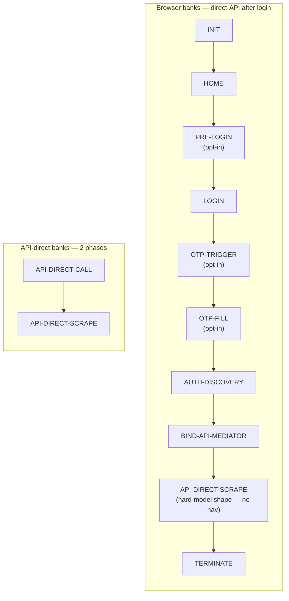

# Pipeline architecture

The pipeline is a **declarative chain of typed phases** orchestrated by `PipelineExecutor`. Each phase implements `BasePhase` and owns four sub-step hooks: `pre`, `action`, `post`, `final`. The executor drives them in order, threading an immutable `IPipelineContext` snapshot between phases.

## The phase chain (direct-API after login)



| Slot | Phase | Always-on? | Owner concern |
|---|---|---|---|
| 1 | [INIT](../phases/init.md) | ✅ browser | Launch Camoufox, build the `IPipelineContext`, navigate to bank URL |
| 2 | [HOME](../phases/home.md) | ✅ browser | Landing-page discovery, signal login readiness |
| 3 | [PRE-LOGIN](../phases/pre-login.md) | ⚙️ opt-in | Card banks with a "show login" toggle (Amex, Isracard, Max, VisaCal) |
| 4 | [LOGIN](../phases/login.md) | ✅ browser | 7-strategy `SelectorResolver` + declarative `LoginConfig` |
| 5 | [OTP-TRIGGER](../phases/otp-trigger.md) | ⚙️ opt-in | Ask bank to dispatch SMS (Beinleumi-group, Hapoalim conditional) |
| 6 | [OTP-FILL](../phases/otp-fill.md) | ⚙️ opt-in | Fill the code returned by `otpCodeRetriever` |
| 7 | [AUTH-DISCOVERY](../phases/auth-discovery.md) | ✅ browser | Capture post-login auth token + API origin from network |
| 8 | `BIND-API-MEDIATOR` | ✅ browser | Bind an authenticated `ApiMediator` to the live login page; prime bearer / session token from the capture pool |
| 9 | [API-DIRECT-SCRAPE](../phases/api-direct-scrape.md) | ✅ all | Walk the bank's typed hard-model shape (accounts + balances + transactions) over direct REST/GraphQL — no nav; `.final` emits `ctx.balanceResolution` |
| 10 | [TERMINATE](../phases/terminate.md) | ✅ browser | Close page/context/browser, finalise `IScraperScrapingResult` |
| — | [API-DIRECT-CALL](../phases/api-direct-call.md) | api-direct only | Replaces INIT…OTP-FILL for OneZero/Pepper/PayBox |
| — | _dormant_: [ACCOUNT-RESOLVE](../phases/account-resolve.md) · [DASHBOARD](../phases/dashboard.md) · [SCRAPE](../phases/scrape.md) · [BALANCE-RESOLVE](../phases/balance-resolve.md) | — | The retired generic navigation + DOM-scrape chain. Still in the codebase (ESLint canaries guard the boundary) but **no pipeline bank triggers them** — superseded by `BIND-API-MEDIATOR` + `API-DIRECT-SCRAPE`. |

## The Procedure result pattern

Every action returns `Procedure<T> = { success: true, value: T } | { success: false, errorType, errorMessage }`. Phases never throw exceptions across boundaries; they return Procedures and the executor consults `.success` to decide whether to advance.

```typescript
type Procedure<T> =
  | { readonly success: true; readonly value: T }
  | { readonly success: false; readonly errorType: ScraperErrorTypes; readonly errorMessage: string };
```

| Helper | Use |
|---|---|
| `succeed(value)` | Build the success branch |
| `fail(type, msg)` | Build the failure branch |
| `isOk(p)` | Boolean type-guard |
| `toLegacy(p)` | Convert to the public `IScraperScrapingResult` shape |
| `assertOk(p)` | Test-only — `expect(p.success).toBe(true)` + type narrowing |

See [`Procedure.ts`](https://github.com/sergienko4/israeli-bank-scrapers/blob/{{BRANCH}}/src/Scrapers/Pipeline/Types/Procedure.ts).

## IPipelineContext — the shared state slot table

`IPipelineContext` is a discriminated record of `Option<T>` slots. Each phase reads the slots its `pre`/`action`/`post`/`final` declare, and writes only the slots it owns. The compiler enforces that no phase writes outside its declared scope.

Key slots (v8.6+):

| Slot | Owner | Purpose |
|---|---|---|
| `browser` | INIT | Playwright browser + context + page |
| `login` | LOGIN | `persistentOtpToken`, `urlBeforeSubmit` |
| `apiMediator` | BIND-API-MEDIATOR (browser) · headless context wiring (api-direct) | Authenticated `ApiMediator`. **Browser banks:** `BIND-API-MEDIATOR` commits a page-bound mediator to the live login page (+ any primed bearer / session token). **api-direct banks:** wired at context build via `createBrowserBackedHeadlessApiMediator`, then consumed by `API-DIRECT-CALL` |
| `scrape` | API-DIRECT-SCRAPE.post | `accounts`, `accountIdentities` produced by the hard-model shape |
| `balanceResolution` | API-DIRECT-SCRAPE.final | Final `Map<accountNumber, number>` → `PipelineResult` |
| _dormant_ | ACCOUNT-RESOLVE / DASHBOARD / BALANCE-RESOLVE | `accountDiscovery`, `txnEndpoint`, `dashboardTxnHarvest`, `balanceFetchPlan`, `balanceResponsesByBankAccount`, `balanceExtracted`, `balanceValidation` — slots of the retired generic chain; still declared on `IPipelineContext` but written by no pipeline bank |

> Both paths converge on the same `apiMediator` → `scrape` → `balanceResolution` slots. They differ only in **who mints the mediator**: `BIND-API-MEDIATOR` for browser banks (page-bound, post-auth); the headless context wiring — consumed by `API-DIRECT-CALL` — for api-direct banks.

The two paths converge on `balanceResolution` — that's the single source of truth read by [`PipelineResult.combineWithBalance`](https://github.com/sergienko4/israeli-bank-scrapers/blob/{{BRANCH}}/src/Scrapers/Pipeline/Core/PipelineResult.ts).

## Interceptors — cross-cutting, no data

| Interceptor | Runs between | Job |
|---|---|---|
| **PopupInterceptor** | HOME / before the api-direct scrape | Dismiss modal overlays by visible text |
| **NetworkDiscovery** | (whole run) | Index every HTTP request/response post-auth, redact body+URL before write, feed endpoints to BIND-API-MEDIATOR + API-DIRECT-SCRAPE |

Source: [`src/Scrapers/Pipeline/Interceptors/`](https://github.com/sergienko4/israeli-bank-scrapers/tree/{{BRANCH}}/src/Scrapers/Pipeline/Interceptors).

### Network-discovery contract types

The `NetworkDiscovery` interceptor exposes two type-only contracts that
downstream phases (BIND-API-MEDIATOR, API-DIRECT-SCRAPE) import to
consume the capture pool without coupling to the live implementation:

- `INetworkDiscovery` — the mediator-side contract: capture-lifecycle
  flags, `markDashboardClickAt` / `getPreNavCaptures` /
  `getPostNavCaptures` partitioning, pattern-based `findEndpoints` /
  `discoverByPatterns` lookups, plus the auth-failure watcher slot.
- `IDiscoveredEndpoint` — the per-capture record: URL, method, body,
  headers, `captureIndex` (the same `NNNN-METHOD` prefix used by the
  on-disk `network/` dumps so a log line can be joined to its dump
  file via `runId` + `captureIndex`), and the `PickerTier` annotation
  produced by `discoverShapeAware` to record *which* tier of the
  shape-aware picker selected the endpoint (ordered cleanest →
  loosest: `postWithShape` → `replayablePost` → `shapePassing` →
  `preClickFallback` → `urlOnlyMatch` → `windowParamsMatch` →
  `none`).

## Source pointers

- [`PipelineAssembly.ts`](https://github.com/sergienko4/israeli-bank-scrapers/blob/{{BRANCH}}/src/Scrapers/Pipeline/Core/Builder/PipelineAssembly.ts) — `PHASE_CHAIN` slot declarations
- [`PipelineExecutor.ts`](https://github.com/sergienko4/israeli-bank-scrapers/blob/{{BRANCH}}/src/Scrapers/Pipeline/Core/Executor/PipelineExecutor.ts) — drives the slots in order
- [`BasePhase.ts`](https://github.com/sergienko4/israeli-bank-scrapers/blob/{{BRANCH}}/src/Scrapers/Pipeline/Types/BasePhase.ts) — `pre`/`action`/`post`/`final` contract every phase implements
- [`PipelineContextFactory.ts`](https://github.com/sergienko4/israeli-bank-scrapers/blob/{{BRANCH}}/src/Scrapers/Pipeline/Core/PipelineContextFactory.ts) — builds the initial context per run
