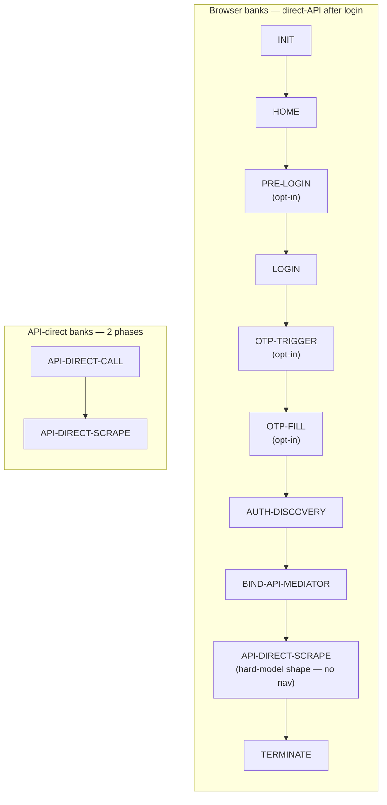

# Pipeline architecture

The pipeline is a **declarative chain of typed phases** orchestrated by `PipelineExecutor`. Each phase implements `BasePhase` and owns four sub-step hooks: `pre`, `action`, `post`, `final`. The executor drives them in order, threading an immutable `IPipelineContext` snapshot between phases.

## The phase chain (direct-API after login)


```mermaid
flowchart TD
    subgraph "Browser banks — direct-API after login"
      direction TB
      I[INIT] --> H[HOME] --> PL["PRE-LOGIN<br/>(opt-in)"]
      PL --> L[LOGIN] --> OT["OTP-TRIGGER<br/>(opt-in)"]
      OT --> OF["OTP-FILL<br/>(opt-in)"]
      OF --> AD[AUTH-DISCOVERY] --> BIND[BIND-API-MEDIATOR]
      BIND --> ADS["API-DIRECT-SCRAPE<br/>(hard-model shape — no nav)"] --> T[TERMINATE]
    end

    subgraph "API-direct banks — 2 phases"
      direction TB
      ADC[API-DIRECT-CALL] --> ADS2[API-DIRECT-SCRAPE]
    end
```

| Slot | Phase                                                                                                                                                                              | Always-on?      | Owner concern                                                                                                                                                                                                   |
| ---- | ---------------------------------------------------------------------------------------------------------------------------------------------------------------------------------- | --------------- | --------------------------------------------------------------------------------------------------------------------------------------------------------------------------------------------------------------- |
| 1    | [INIT](../phases/init.md)                                                                                                                                                          | ✅ browser      | Launch Camoufox, build the `IPipelineContext`, navigate to bank URL                                                                                                                                             |
| 2    | [HOME](../phases/home.md)                                                                                                                                                          | ✅ browser      | Landing-page discovery, signal login readiness                                                                                                                                                                  |
| 3    | [PRE-LOGIN](../phases/pre-login.md)                                                                                                                                                | ⚙️ opt-in       | Card banks with a "show login" toggle (Amex, Isracard, Max, VisaCal)                                                                                                                                            |
| 4    | [LOGIN](../phases/login.md)                                                                                                                                                        | ✅ browser      | 7-strategy `SelectorResolver` + declarative `LoginConfig`                                                                                                                                                       |
| 5    | [OTP-TRIGGER](../phases/otp-trigger.md)                                                                                                                                            | ⚙️ opt-in       | Ask bank to dispatch SMS (Beinleumi-group, Hapoalim conditional)                                                                                                                                                |
| 6    | [OTP-FILL](../phases/otp-fill.md)                                                                                                                                                  | ⚙️ opt-in       | Fill the code returned by `otpCodeRetriever`                                                                                                                                                                    |
| 7    | [AUTH-DISCOVERY](../phases/auth-discovery.md)                                                                                                                                      | ✅ browser      | Capture post-login auth token + API origin from network                                                                                                                                                         |
| 8    | `BIND-API-MEDIATOR`                                                                                                                                                                | ✅ browser      | Bind an authenticated `ApiMediator` to the live login page; prime bearer / session token from the capture pool                                                                                                  |
| 9    | [API-DIRECT-SCRAPE](../phases/api-direct-scrape.md)                                                                                                                                | ✅ all          | Walk the bank's typed hard-model shape (accounts + balances + transactions) over direct REST/GraphQL — no nav; `.final` emits `ctx.balanceResolution`                                                           |
| 10   | [TERMINATE](../phases/terminate.md)                                                                                                                                                | ✅ browser      | Close page/context/browser, finalise `IScraperScrapingResult`                                                                                                                                                   |
| —    | [API-DIRECT-CALL](../phases/api-direct-call.md)                                                                                                                                    | api-direct only | Replaces INIT…OTP-FILL for OneZero/Pepper/PayBox                                                                                                                                                                |
| —    | _dormant_: [ACCOUNT-RESOLVE](../phases/account-resolve.md) · [DASHBOARD](../phases/dashboard.md) · [SCRAPE](../phases/scrape.md) · [BALANCE-RESOLVE](../phases/balance-resolve.md) | —               | The retired generic navigation + DOM-scrape chain. Still in the codebase (ESLint canaries guard the boundary) but **no pipeline bank triggers them** — superseded by `BIND-API-MEDIATOR` + `API-DIRECT-SCRAPE`. |

## The Procedure result pattern

Every action returns `Procedure<T> = { success: true, value: T } | { success: false, errorType, errorMessage }`. Phases never throw exceptions across boundaries; they return Procedures and the executor consults `.success` to decide whether to advance.

```typescript
type Procedure<T> =
  | { readonly success: true; readonly value: T }
  | {
      readonly success: false;
      readonly errorType: ScraperErrorTypes;
      readonly errorMessage: string;
    };
```

| Helper            | Use                                                         |
| ----------------- | ----------------------------------------------------------- |
| `succeed(value)`  | Build the success branch                                    |
| `fail(type, msg)` | Build the failure branch                                    |
| `isOk(p)`         | Boolean type-guard                                          |
| `toLegacy(p)`     | Convert to the public `IScraperScrapingResult` shape        |
| `assertOk(p)`     | Test-only — `expect(p.success).toBe(true)` + type narrowing |

See [`Procedure.ts`](https://github.com/sergienko4/israeli-bank-scrapers/blob/{{BRANCH}}/src/Scrapers/Pipeline/Types/Procedure.ts).

## IPipelineContext — the shared state slot table

`IPipelineContext` is a discriminated record of `Option<T>` slots. Each phase reads the slots its `pre`/`action`/`post`/`final` declare, and writes only the slots it owns. The compiler enforces that no phase writes outside its declared scope.

Key slots (v8.6+):

| Slot                | Owner                                                              | Purpose                                                                                                                                                                                                                                                                                       |
| ------------------- | ------------------------------------------------------------------ | --------------------------------------------------------------------------------------------------------------------------------------------------------------------------------------------------------------------------------------------------------------------------------------------- |
| `browser`           | INIT                                                               | Playwright browser + context + page                                                                                                                                                                                                                                                           |
| `login`             | LOGIN                                                              | `persistentOtpToken`, `urlBeforeSubmit`                                                                                                                                                                                                                                                       |
| `apiMediator`       | BIND-API-MEDIATOR (browser) · headless context wiring (api-direct) | Authenticated `ApiMediator`. **Browser banks:** `BIND-API-MEDIATOR` commits a page-bound mediator to the live login page (+ any primed bearer / session token). **api-direct banks:** wired at context build via `createBrowserBackedHeadlessApiMediator`, then consumed by `API-DIRECT-CALL` |
| `scrape`            | API-DIRECT-SCRAPE.post                                             | `accounts`, `accountIdentities` produced by the hard-model shape                                                                                                                                                                                                                              |
| `balanceResolution` | API-DIRECT-SCRAPE.final                                            | Final `Map<accountNumber, number>` → `PipelineResult`                                                                                                                                                                                                                                         |
| _dormant_           | ACCOUNT-RESOLVE / DASHBOARD / BALANCE-RESOLVE                      | `accountDiscovery`, `txnEndpoint`, `dashboardTxnHarvest`, `balanceFetchPlan`, `balanceResponsesByBankAccount`, `balanceExtracted`, `balanceValidation` — slots of the retired generic chain; still declared on `IPipelineContext` but written by no pipeline bank                             |

> Both paths converge on the same `apiMediator` → `scrape` → `balanceResolution` slots. They differ only in **who mints the mediator**: `BIND-API-MEDIATOR` for browser banks (page-bound, post-auth); the headless context wiring — consumed by `API-DIRECT-CALL` — for api-direct banks.

The two paths converge on `balanceResolution` — that's the single source of truth read by [`PipelineResult.combineWithBalance`](https://github.com/sergienko4/israeli-bank-scrapers/blob/{{BRANCH}}/src/Scrapers/Pipeline/Core/PipelineResult.ts).

## contextIds — addressing a frame across the PRE→ACTION seal

`buildActionContext` seals the raw `Page` away before `action()` runs, so
ACTION cannot hold a `Frame` reference that PRE discovered. Instead PRE mints
an opaque **contextId** for the frame it resolved, and ACTION rebuilds a
registry from the live page and looks the id back up.

| Stage  | Call                            | What happens                                        |
| ------ | ------------------------------- | --------------------------------------------------- |
| PRE    | `computeContextId(frame, page)` | Mints the id, stored on `IResolvedTarget.contextId` |
| ACTION | `buildFrameRegistry(page)`      | Snapshots `page.frames()` at action-entry           |
| ACTION | `resolveFrame(registry, id)`    | Maps the id back to a live `Frame`                  |

The id has two halves, `<token>|<base>`, and each covers the other's blind
spot.

The **base** is content-derived — `iframe:<origin><pathname>` for a real URL,
`iframe:<frame.name()>` for `about:blank`. The query string is stripped on
purpose: a session token in the URL changes between PRE and ACTION, and an id
that embedded it would stop resolving.

Content is stable but not unique. Two sibling iframes can share an
origin+pathname (differing only in the stripped query), and two unnamed
`about:blank` frames both reduce to the bare prefix. So the id also carries a
**token** — an opaque per-`Frame` identity minted from a `WeakMap`. It pins
the exact frame instance, and because it is keyed on the object it never
changes when a sibling attaches or detaches. Without it the registry silently
kept only the last writer, and a credential could be typed into a frame that
was never resolved.

When a frame's base is **already shared** at mint time, `computeContextId`
drops the base entirely and returns the bare token. Such an id is
identity-only: it resolves while that exact frame lives and refuses once it
dies, so it can never content-fall-back onto a surviving sibling. The cost is
cosmetic — an ambiguous frame logs as `f7` with no human-readable base.

Because that shape has no `<token>|<base>` split, the registry reads each
frame's token from the frame itself rather than parsing it back out of the id
it just minted. Every frame is therefore indexed by identity whatever shape
its id took, and no registry key is ever empty — an empty key would be
claimed by each ambiguous sibling in turn and hand the last writer back to
any caller with a blank id.

`resolveFrame` narrows in three steps. The full id is an exact
content-and-identity match. The bare token alone still pins the same live
frame after it navigated and its content-derived base changed. Only once
identity is gone — the frame detached and re-attached as a new object — does
resolution fall back to the bare base id, matching on content the way it did
before the token existed.

That last fallback is only registered when the base id is **unique** among the
live frames. If two siblings share a base, neither claims it, and an id that
reaches the fallback resolves to nothing rather than to an arbitrary sibling —
`resolveFrame` throws. Guessing here would type a credential into a frame that
was never resolved, so refusing is the safer failure. Positional
disambiguation is not an option: a re-attached frame moves to the back of
`page.frames()`, so an ordinal recorded at PRE points at a different frame by
ACTION and would resolve confidently to the wrong one.

Consumers that need to ask "is this the same context?" compare with
`isSameContext(page, a, b)`, not `===`. Two ids alone cannot answer the
question — the same string comparison that unites a re-attached frame with its
former self also unites two live siblings. So the comparison resolves both ids
against the live page and re-mints them, giving three outcomes:

| Outcome                | When                                               |
| ---------------------- | -------------------------------------------------- |
| Definitely the same    | Both ids resolve, and re-minting yields one id     |
| Definitely different   | Both resolve, but to two frames that are alive now |
| Unprovable → different | Either id no longer resolves to any live frame     |

Identical strings short-circuit to `true` before any resolution. The
"unprovable" case is deliberately conservative: a caller that cannot prove two
ids name one frame must not act as if they do.

Source: [`FrameRegistry.ts`](https://github.com/sergienko4/israeli-bank-scrapers/blob/{{BRANCH}}/src/Scrapers/Pipeline/Mediator/Elements/FrameRegistry.ts).

## Interceptors — cross-cutting, no data

| Interceptor          | Runs between                        | Job                                                                                                                                |
| -------------------- | ----------------------------------- | ---------------------------------------------------------------------------------------------------------------------------------- |
| **PopupInterceptor** | HOME / before the api-direct scrape | Dismiss modal overlays by visible text                                                                                             |
| **NetworkDiscovery** | (whole run)                         | Index every HTTP request/response post-auth, redact body+URL before write, feed endpoints to BIND-API-MEDIATOR + API-DIRECT-SCRAPE |

Source: [`src/Scrapers/Pipeline/Interceptors/`](https://github.com/sergienko4/israeli-bank-scrapers/tree/{{BRANCH}}/src/Scrapers/Pipeline/Interceptors).

### Network-discovery contract types

The `NetworkDiscovery` interceptor exposes two type-only contracts that
downstream phases (BIND-API-MEDIATOR, API-DIRECT-SCRAPE) import to
consume the capture pool without coupling to the live implementation:

- `INetworkDiscovery` — the mediator-side contract: capture-lifecycle
  flags, `markDashboardClickAt` / `getPreNavCaptures` /
  `getPostNavCaptures` partitioning, pattern-based `findEndpoints` /
  `discoverByPatterns` lookups, plus the auth-failure watcher slot.
- `IDiscoveredEndpoint` — the per-capture record: URL, method, body,
  headers, `captureIndex` (the same `NNNN-METHOD` prefix used by the
  on-disk `network/` dumps so a log line can be joined to its dump
  file via `runId` + `captureIndex`), and the `PickerTier` annotation
  produced by `discoverShapeAware` to record _which_ tier of the
  shape-aware picker selected the endpoint (ordered cleanest →
  loosest: `postWithShape` → `replayablePost` → `shapePassing` →
  `preClickFallback` → `urlOnlyMatch` → `windowParamsMatch` →
  `none`).

## Source pointers

- [`PipelineAssembly.ts`](https://github.com/sergienko4/israeli-bank-scrapers/blob/{{BRANCH}}/src/Scrapers/Pipeline/Core/Builder/PipelineAssembly.ts) — `PHASE_CHAIN` slot declarations
- [`PipelineExecutor.ts`](https://github.com/sergienko4/israeli-bank-scrapers/blob/{{BRANCH}}/src/Scrapers/Pipeline/Core/Executor/PipelineExecutor.ts) — drives the slots in order
- [`BasePhase.ts`](https://github.com/sergienko4/israeli-bank-scrapers/blob/{{BRANCH}}/src/Scrapers/Pipeline/Phases/Base/BasePhase.ts) — `pre`/`action`/`post`/`final` contract every phase implements
- [`PipelineContextFactory.ts`](https://github.com/sergienko4/israeli-bank-scrapers/blob/{{BRANCH}}/src/Scrapers/Pipeline/Core/PipelineContextFactory.ts) — builds the initial context per run
