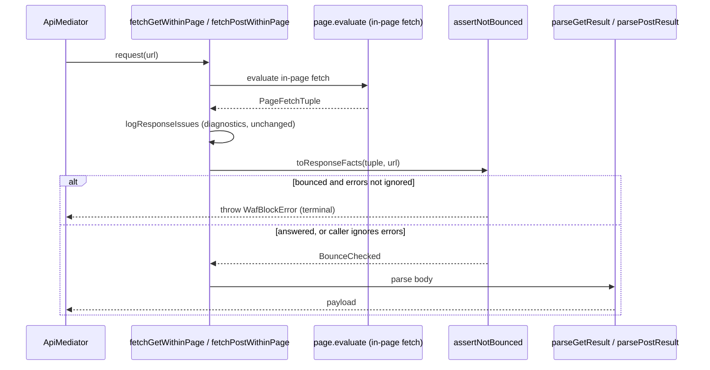

# WAF fetch bounce (typed in-page fetch failures)

> **Status:** Response-side WAF handling for the in-page `fetch` carriers.
> **Scope:** Bank-agnostic, phase-agnostic. Applies to every `fetchGetWithinPage` /
> `fetchGetWithinPageWithHeaders` / `fetchPostWithinPage` call.
>
> **See also:** [WAF challenge interceptor](waf-interceptor.md) — the *other* half
> of WAF handling, covering the interactive checkbox challenge that appears during
> browser navigation. That page is about clicking a challenge; this page is about
> classifying a response.

## Why this exists

The pipeline issues API calls from inside the page so they carry the real session
cookies and TLS fingerprint. When a bank's WAF intercepts one of those XHRs it
answers with an HTML interstitial — frequently under **HTTP 200** — and when a
session has lapsed the request is redirected to an HTML login page instead.

Either way the body reaches `JSON.parse`, which throws:

```text
… parse error: Unexpected token '<', "<html>…" is not valid JSON
```

That message is technically true and diagnostically useless. It is
indistinguishable from a genuine payload bug, so an operator reading the log
cannot tell "the bank changed its schema" from "we were blocked".

The block was in fact already **detected** — `logResponseIssues` ran
`detectWafBlock` one line earlier and wrote a debug line — and then the result
was discarded. This module keeps that verdict and raises it as a typed
`WafBlockError`.

Two layers then map that error to `ScraperErrorTypes.WafBlocked`, depending on
which path the caller came in on, and both preserve `details`:

| Layer | Path | Mapping |
|---|---|---|
| `Strategy/Fetch/BrowserFetchStrategy.ts` | Pipeline — the throw crosses into a `Procedure` | `failWithDetails(WafBlocked, message, error.details)` |
| `Base/BaseScraper.ts` | Legacy — the throw reaches the scraper's top-level handler | `createWafBlockedError(error.message, error.details)` |

## The gated rule

A response is classified as a **bounce** only when **both** conditions hold:

1. **The body is not usable as JSON** — the `content-type` does not contain
   `json`, *and* the trimmed body does not survive `JSON.parse`. An empty body
   counts as usable, because the parser turns it into `{}`.
2. **A signal fired** — the status/body WAF heuristic recognised a provider, or
   the browser followed a redirect.

Condition 1 is the safety gate, and it is deliberately first.

`ScraperErrorTypes.WafBlocked` is **terminal**: `Mediator/Api/ApiMediator.retry.ts`
returns `false` for it, so a call reported as a WAF block is never retried.
Classifying an origin's own rate-limit or maintenance envelope as a bounce would
therefore convert a run that recovers today into a hard failure. Because
condition 1 is false for every response that parses successfully today, the
regression surface is zero: only the *class* and *message* of an
already-throwing error change.

## Crossing the strategy boundary

Most banks do not call the fetch helpers directly — they reach them through
`Strategy/Fetch/BrowserFetchStrategy.ts`, which converts a thrown error into a
`Procedure` failure. That converter classifies by type, and `WafBlockError` is
recognised alongside `TimeoutError`; without that branch the typed verdict would
be flattened back to `ScraperErrorTypes.Generic` and the structured `details`
would be dropped for every bank on that path.

The mapping is behaviour-neutral for retries. `AUTH_REJECT_REGEX` matches a
` 403: ` fragment, whereas the parse-error message this replaces rendered the
status as `status: 403` — so the old `Generic` failure was never retried either.
What changes is that the block is now *named*, and can no longer be mistaken for
a schema drift.

| Response | Bounced? | Why |
|---|---|---|
| `200` + `<html>Just a moment…` | **yes** | Not JSON, WAF signal fires |
| `403`/`429`/`503` + HTML body | **yes** | Not JSON, WAF signal fires |
| `200` + HTML login page after redirect | **yes** | Not JSON, redirect signal fires |
| `429` + `{"error":"rate_limited"}` | no | Usable JSON — stays retryable |
| `503` + `{"maintenance":true}` | no | Usable JSON — stays retryable |
| `204` + empty body | no | Empty body parses to `{}` |
| `200` + `[1,2,3]`, no `content-type` | no | Body parses as JSON |
| `302` + `123` as `text/plain` | no | A JSON primitive still parses |

> **Why the redirect signal is gated, never standalone.** The only redirect this
> repository has captured on the fetch path is the Hapoalim header-mismatch
> `302`, which is *not* a lapsed session. A redirect on its own therefore proves
> nothing; it only becomes evidence once the body has already been shown to be
> unparseable. For the same reason the reason text names the redirect target
> rather than claiming the session expired.

## Architecture

Two files under
[`src/Scrapers/Pipeline/Mediator/Network/Fetch/`](https://github.com/sergienko4/israeli-bank-scrapers/blob/{{BRANCH}}/src/Scrapers/Pipeline/Mediator/Network/Fetch),
split policy-from-logic the same way `LandingDocument` / `LandingDocumentConfig`
already are.

| Symbol | File | Role |
|---|---|---|
| `BounceReason` | `BounceConfig.ts` | Branded reason string; the empty string is the "not bounced" value, matching the `WafBlockDescription` convention in `WafDetection.ts` |
| `JSON_TYPE_MARKER` | `BounceConfig.ts` | Content-type substring (`json`) matched case-insensitively, so `application/json`, `application/problem+json` and `text/json` all qualify |
| `PageFetchTuple` | `Bounce.ts` | Wire format every in-page evaluator returns: `[text, status, contentType?, redirected?, finalUrl?]` |
| `IResponseFacts` | `Bounce.ts` | Plain-data classifier input — no `Response`, no `Page`, so classification is pure and testable without a browser |
| `toResponseFacts` | `Bounce.ts` | Converts a `PageFetchTuple` plus the requested URL into `IResponseFacts` |
| `IBounceSignal` | `Bounce.ts` | One detector: a `name` plus a `describe` that returns the reason, or the empty string when it does not fire |
| `describeBounce` | `Bounce.ts` | Applies the gate, then walks the signal table; returns the reason or the empty string |
| `assertNotBounced` | `Bounce.ts` | Raises `WafBlockError.apiBlock` when bounced; honours the caller's ignore-errors contract first |
| `BounceChecked` | `Bounce.ts` | Branded marker `assertNotBounced` returns, so the "no primitive returns" rule holds |

### Where the guard sits



The guard runs **after** `logResponseIssues` — so the existing debug telemetry is
unchanged — and **before** the parser, which is the line where the verdict used
to be thrown away.

## Tuple compatibility

The trailing three slots of `PageFetchTuple` were appended after the fact. Any
evaluator — or test double — that still yields a two-element `[text, status]`
tuple reads the missing slots as `undefined`, which leaves it on its original
behaviour: no content-type means the body itself decides, and an absent
`redirected` flag never fires the redirect signal. A regression test pins this.

## PII

The blocked URL is passed through `redactUrlFull` before it reaches the error, so
an account-bearing path such as `/api/accounts/1234567890` is recorded as
`***7890`. The response body is passed through `redactHtml` before it is stored
in `details.responseSnippet`, and never reaches the message at all.

Redacting the body — rather than only truncating it, as `WafBlockError.apiBlock`
does on its own — matters for the redirect signal specifically: a login page is
rendered *for this customer*, so its markup can echo an account number in a text
node or a name in an `<input value="…">` attribute. Both are covered.

Note that `WafBlockError`'s message deliberately omits the URL — the blocked
request is identified structurally via `details.pageUrl`. Assertions and log
consumers should read the detail, not parse the message.

## Extending — add a new bounce signal (Open/Closed)

1. Write a `describe` that returns a `BounceReason`, or the empty string when it
   does not fire.
2. Append the new `IBounceSignal` to the `BOUNCE_SIGNALS` table in `Bounce.ts`.

`describeBounce` and `assertNotBounced` never change. This is the same frozen
table shape as `WafChallengeSolverRegistry.ts` in the
[browser-side interceptor](waf-interceptor.md).

## Source pointers

| File | Role |
|---|---|
| [`Mediator/Network/Fetch/Bounce.ts`](https://github.com/sergienko4/israeli-bank-scrapers/blob/{{BRANCH}}/src/Scrapers/Pipeline/Mediator/Network/Fetch/Bounce.ts) | Classifier and signal table |
| [`Mediator/Network/Fetch/BounceConfig.ts`](https://github.com/sergienko4/israeli-bank-scrapers/blob/{{BRANCH}}/src/Scrapers/Pipeline/Mediator/Network/Fetch/BounceConfig.ts) | Policy constants and the reason brand |
| [`Mediator/Network/Fetch/PageFetchGet.ts`](https://github.com/sergienko4/israeli-bank-scrapers/blob/{{BRANCH}}/src/Scrapers/Pipeline/Mediator/Network/Fetch/PageFetchGet.ts) | GET carriers; collects the facts and calls the guard |
| [`Mediator/Network/Fetch/PageFetchPost.ts`](https://github.com/sergienko4/israeli-bank-scrapers/blob/{{BRANCH}}/src/Scrapers/Pipeline/Mediator/Network/Fetch/PageFetchPost.ts) | POST carrier; same wiring |
| [`Mediator/Network/Fetch/WafDetection.ts`](https://github.com/sergienko4/israeli-bank-scrapers/blob/{{BRANCH}}/src/Scrapers/Pipeline/Mediator/Network/Fetch/WafDetection.ts) | The status/body heuristic the WAF signal reuses |
| [`Base/Errors.ts`](https://github.com/sergienko4/israeli-bank-scrapers/blob/{{BRANCH}}/src/Scrapers/Base/Errors.ts) | `WafBlockError.apiBlock` and the `IWafErrorDetails` shape |
