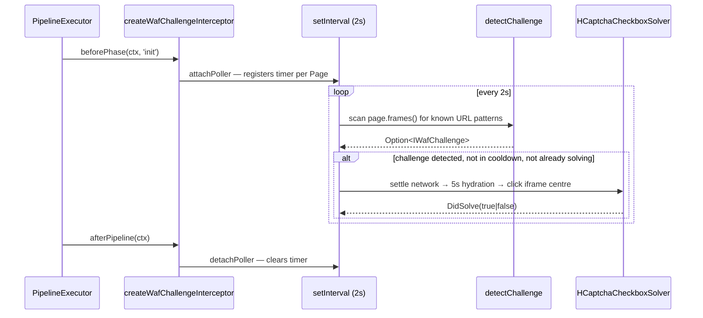

# WAF challenge interceptor

> **Status:** Shipped in PR #282 — generic background WAF challenge interceptor.
> **Scope:** Bank-agnostic, phase-agnostic. Wired FIRST in every browser pipeline.

## Why this exists

Banks fronted by Imperva or Cloudflare may interleave a **WAF checkbox challenge** (hCaptcha "I am human" / Cloudflare Turnstile) into the navigation flow. Without handling, the host scraper sees the page never finish loading and times out. A bank-specific patch would copy the same recipe into every Imperva-protected scraper.

The interceptor centralises the recipe in one place: detect the challenge frame, click the checkbox iframe centre via Camoufox's humanized mouse, and let the page continue. Adding a new bank that adopts Imperva requires zero new code.

## Architecture

Single cluster under [`src/Scrapers/Pipeline/Interceptors/WafChallenge/`](https://github.com/[REDACTED-USER]/israeli-bank-scrapers/blob/{{BRANCH}}/src/Scrapers/Pipeline/Interceptors/WafChallenge):

| File | Purpose |
|---|---|
| `WafChallengeInterceptor.ts` | Thin factory `createWafChallengeInterceptor` — the **only** consumer-facing surface |
| `WafChallengeConfig.ts` | Pinned constants: poll interval (2 s), networkidle ceiling (15 s), hydration (5 s), cool-down (8 s), URL patterns, env var name |
| `WafChallengeTypes.ts` | Branded types — `DidSolve`, `WafChallengeKind`, `IWafChallenge`, `ISolverArgs`, `WafChallengeSolver` |
| `WafChallengeDetector.ts` | Pure-function frame URL classifier — `detectChallenge(page)` returns `Option<IWafChallenge>` |
| `HCaptchaCheckboxSolver.ts` | Camoufox auto-pass recipe (settle → wait → click) |
| `TurnstileCheckboxSolver.ts` | Delegates to hCaptcha solver (same primitive) |
| `WafChallengeSolverRegistry.ts` | Frozen `Record<WafChallengeKind, WafChallengeSolver>` — Open/Closed extensibility |
| `WafChallengeInternals.ts` | Poller / state primitives (see "Implementation primitives" below) |

## How it works



## Camoufox auto-pass recipe (why a single click works)

The host scraper launches Camoufox with three knobs enabled (in `CamoufoxLauncher.ts`):

| Knob | Purpose |
|---|---|
| `humanize: true` | C++-level curved cursor approach + jittered timing per click |
| `disable_coop: true` | Iframe can postMessage its token back to the parent SPA |
| `block_webrtc: true` | Closes the WebRTC fingerprint leak path many WAFs key off |

With those three set, `page.mouse.click(centreX, centreY)` on the hCaptcha checkbox iframe is enough to emit a valid `h-captcha-response` token. The interceptor doesn't reinvent any of this — it just runs the documented Camoufox recipe at the right moment.

## Detection rules

| Provider | Detector matches when `frame.url()` contains... |
|---|---|
| hCaptcha checkbox | `hcaptcha.html#frame=checkbox` |
| Cloudflare Turnstile checkbox | `challenges.cloudflare.com/cdn-cgi/challenge-platform` |

> **Important:** hCaptcha mounts TWO iframes per widget — `#frame=checkbox` (visible, user-clickable) and `#frame=challenge` (the puzzle modal, hidden at `y = -9999` until the checkbox is clicked). Clicking the puzzle modal centre does NOT solve the challenge. The pattern deliberately excludes `#frame=challenge`. A regression test in `WafChallengeDetector.test.ts` pins this invariant.

## Kill-switch

If the interceptor causes a regression, disable it without rebuilding:

```bash
WAF_INTERCEPTOR_DISABLED=1 npm run my-scrape
```

- Accepted values: `1`, `true` (any case)
- Any other value (including `yes`, `on`) leaves the interceptor active (strict allowlist)
- Effective at the next pipeline-phase boundary

The kill-switch is also useful for bisecting whether a future scrape regression is interceptor-related.

## Telemetry

Three `pino` debug-level events emit per solve attempt via `ctx.logger`:

| Event | Payload | When |
|---|---|---|
| `waf.interceptor.attached` | `{event}` | First phase with a browser attaches the poller |
| `waf.solve.start` | `{event, kind}` | Solver dispatch begins |
| `waf.solve.done` | `{event, kind, didSolve}` | Solver returns |

No PII flows through these events — only the `kind` enum (`hcaptcha-checkbox` / `turnstile-checkbox`) and the boolean outcome.

## Lifecycle guarantees

- **Idempotent attach:** `attachPoller` checks a `WeakSet<Page>` first — repeated calls (one per phase) never create duplicate timers
- **Auto-detach on page close:** `wirePageClose` registers a `page.on('close')` listener that clears the timer — no leaked intervals when the page is gone
- **Cool-down:** at most one click attempt per page per 8 s (`isInCooldown` predicate) — avoids hammering the WAF
- **Solving mutex:** a `WeakSet<Page>` flag (`solving`) prevents two concurrent solver invocations on the same page
- **Never fails the pipeline:** `runBeforePhase` and `runAfterPipeline` always return `succeed(ctx)` / `succeed(true)` — every failure inside the solver is contained

## Failure mode → recovery (exhaustive)

| Failure | Recovery |
|---|---|
| Solver throws | `runSolverGuarded` catches; returns `DidSolve(false)`; poller retries after cool-down |
| Frame detaches mid-detect | Defensive `safeFrameUrl` returns empty string; frame skipped |
| `frame.frameElement()` throws | `getFrameElement` returns `false` sentinel; solver returns `DidSolve(false)` |
| `handle.boundingBox()` returns `null` or throws | `getBoundingBox` returns `false`; solver returns `DidSolve(false)` |
| `page.mouse.click` throws (page closed during click) | `clickCentreSafe` catches; returns `DidSolve(false)` |
| Page closes during poll | `wirePageClose` handler clears the timer; state collected by GC |
| Browser not on context (`ctx.browser.has === false`) | `runBeforePhase` short-circuits; returns `succeed(ctx)` without attaching |
| Kill-switch on | `isDisabled` reads env first; short-circuits to `succeed(ctx)` |

## Implementation primitives

`WafChallengeInternals.ts` exposes these helpers for unit-test isolation (they are NOT part of the consumer-facing surface — use `createWafChallengeInterceptor` for that):

- `makeState` — builds a fresh per-instance `IInterceptorState` record with empty WeakSet/WeakMap holders
- `attachPoller` — registers the `setInterval` timer + `wirePageClose` handler; idempotent
- `detachPoller` — clears the interval + removes the timer entry from state
- `buildIntervalHandler` — wraps async `tickOnce` in a sync `setInterval` callback
- `wirePageClose` — registers `page.on('close', detachPoller)`
- `tickOnce` — one detect+solve cycle; guards re-entrance and cool-down
- `runSolverSafe` — looks up solver via registry; catches throws into `DidSolve(false)`
- `runSolverGuarded` — marks page as solving, dispatches solver, logs outcome, releases mutex, records cool-down timestamp
- `runBeforePhase` — the `IPipelineInterceptor.beforePhase` body
- `runAfterPipeline` — the `IPipelineInterceptor.afterPipeline` body
- `isDisabled` — reads `WAF_INTERCEPTOR_DISABLED` env var; returns branded `IsDisabled`
- `isInCooldown` — compares `lastSolveAtMs` against the 8 s window; returns branded `IsInCooldown`

## Extending — add a new challenge kind (Open/Closed)

1. Add a member to the `WafChallengeKind` union in `WafChallengeTypes.ts` (e.g. `'arkose-funcaptcha'`)
2. Add the URL pattern constant in `WafChallengeConfig.ts` (`as const` tuple)
3. Create a new solver file (e.g. `ArkoseFunCaptchaSolver.ts`) implementing `WafChallengeSolver`
4. Register `kind → solver` in `WafChallengeSolverRegistry.ts`
5. Add a detector branch in `WafChallengeDetector.ts`

**No edits required to:** `WafChallengeInterceptor.ts`, `WafChallengeInternals.ts`, `PipelineBuilderHelpers.ts`, or any existing solver. This is the OCP guarantee.

## Source pointers

| File | Role |
|---|---|
| [`Interceptors/WafChallenge/WafChallengeInterceptor.ts`](https://github.com/[REDACTED-USER]/israeli-bank-scrapers/blob/{{BRANCH}}/src/Scrapers/Pipeline/Interceptors/WafChallenge/WafChallengeInterceptor.ts) | Factory entry point |
| [`Core/Builder/PipelineBuilderHelpers.ts`](https://github.com/[REDACTED-USER]/israeli-bank-scrapers/blob/{{BRANCH}}/src/Scrapers/Pipeline/Core/Builder/PipelineBuilderHelpers.ts) | Wires interceptor FIRST in `buildBrowserBaseInterceptors()` |
| [`Interceptors/WafChallenge/WafChallengeDetector.ts`](https://github.com/[REDACTED-USER]/israeli-bank-scrapers/blob/{{BRANCH}}/src/Scrapers/Pipeline/Interceptors/WafChallenge/WafChallengeDetector.ts) | Frame URL classifier |
| [`Interceptors/WafChallenge/HCaptchaCheckboxSolver.ts`](https://github.com/[REDACTED-USER]/israeli-bank-scrapers/blob/{{BRANCH}}/src/Scrapers/Pipeline/Interceptors/WafChallenge/HCaptchaCheckboxSolver.ts) | Solve recipe |
