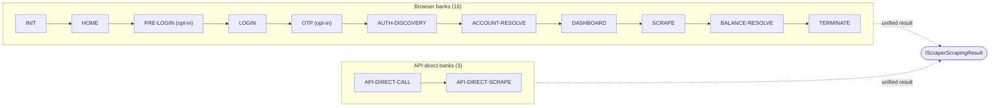

# Israeli Bank Scrapers

Scrape transactions from **19 Israeli banks and credit card companies** with built-in **Cloudflare WAF bypass** and **end-to-end PII redaction**.

```sh
npm install @sergienko4/israeli-bank-scrapers
```

[Quick Start :material-rocket-launch:](quick-start.md){ .md-button .md-button--primary }
[Architecture overview :material-sitemap:](architecture/index.md){ .md-button }
[API Reference :material-code-braces:](https://sergienko4.github.io/israeli-bank-scrapers/api/){ .md-button }

---

## Who is this for?

<div class="grid cards" markdown>

-   :material-account: **Users** — install the package, pick a `CompanyTypes`, pass credentials, receive transactions. Start at **[Quick Start](quick-start.md)** then jump to **[Banks → your bank](banks/index.md)**.

-   :material-developer-board: **Developers** — read **[Architecture → Pipeline](architecture/pipeline.md)** to understand the typed phase chain, then drill into any **[Phase](phases/index.md)** sub-step contract.

-   :material-shield-check: **Maintainers** — **[Workflow → CI gates](workflow/ci.md)** and **[Workflow → Pre-commit](workflow/pre-commit.md)** explain every gate. **[Observability](observability/index.md)** documents the structured events and redaction policy.

-   :material-bank-plus: **Adding a bank?** — **[Contributing → Adding a new bank](contributing/new-bank.md)** is a step-by-step from `CompanyTypes` entry to declarative `PipelineBuilder`.

</div>

## At a glance



| Surface | Counts | Source of truth |
|---|---|---|
| Banks supported | **19** total — 14 on Pipeline, 5 on legacy migration path | [Banks](banks/index.md) |
| Phases | **12** (browser) + **2** (api-direct) | [Phases](phases/index.md) |
| Test suites | 412, ~4,800 tests, 97.20% statements coverage | [Workflow → CI gates](workflow/ci.md) |
| Pre-commit gates | 12 gates in parallel | [Workflow → Pre-commit](workflow/pre-commit.md) |

## What's new

- **v8.4.0** — Two milestones land together:
    - [`BALANCE-RESOLVE` single-phase ownership (v6)](architecture/balance-resolve.md). SCRAPE emits identities + template, BALANCE-RESOLVE owns every live `api.fetchPost`/`fetchGet` and per-card extraction. Universal-miss fail only when **every** card missed.
    - Unified api-direct primitives across OneZero, Pepper, PayBox (signer config DU, `JsonValueTemplate`, carry derivations).
- **v8.3.0** — Pipeline architecture v2 (Strategy / Builder / Mediator / Result patterns, phase isolation, PII redaction).

See [README → Version history](https://github.com/sergienko4/israeli-bank-scrapers#version-history) for the full timeline.

## Migration notice

Everything **outside `src/Scrapers/Pipeline/`** is on a wide-net migration path: `src/Scrapers/Base/`, `src/Common/`, and the 5 legacy bank dirs will fold into Pipeline over time. Public API behavior is preserved. See [Architecture → Migration strategy](architecture/migration.md) for the plan.
