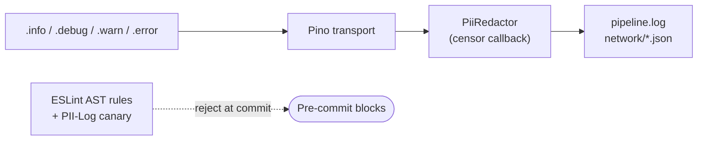

# Observability

> **Who this is for:** maintainers debugging a failed run, security reviewers auditing the redaction guarantee, anyone filing a bug report.

The package auto-redacts PII *before* any line is written and emits structured events at every phase boundary. `pipeline.log` and `network/*.json` are redaction-safe to share, while raster `screenshots/*.png` (opt-in via `FORENSIC_TRACE`) can carry rendered PII. On a failed CI job the entire diagnostics bundle uploads to the access-controlled private store only — CI never publishes a public diagnostics artifact.

## In this section

| Page | What it covers |
|---|---|
| [Structured events](events.md) | Every event the library emits — name, level, fields, when it fires |
| [PII redaction](redaction.md) | What gets redacted, what survives, the two enforcement layers |
| [Forensic audit](forensic-audit.md) | The per-account `--- Account *** | N txns ---` line in `pipeline.log` |

## Two enforcement layers

| Layer | Where it runs | What it catches |
|---|---|---|
| **Runtime** (`PiiRedactor.ts`) | Inside Pino's `redact.censor` callback — every record runs through it before *any* transport writes | Account / card / Israeli ID / phone numbers, customer names, merchant strings, transaction amounts, auth tokens, OTP codes, URLs with PII query keys, HTML text + value attributes |
| **Commit-time** (ESLint AST + `lint-and-validate.ts`) | Every pre-commit and CI run | Code that tries to bypass the runtime: PII identifiers interpolated into `LOG.*` template literals, full payload objects passed under `result|accounts|transactions|...` keys |

If you spot something leaking past both layers, [open an issue](https://github.com/sergienko4/israeli-bank-scrapers/issues) — it's a load-bearing bug, not cosmetic.
