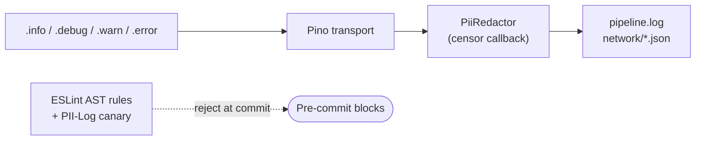

# Observability

> **Who this is for:** maintainers debugging a failed run, security reviewers auditing the redaction guarantee, anyone filing a bug report.

The package auto-redacts PII *before* any line is written and emits structured events at every phase boundary. `pipeline.log` and `network/*.json` are redaction-safe to share, while raster `screenshots/*.png` (opt-in via `FORENSIC_TRACE`) can carry rendered PII. On a failed CI job the entire diagnostics bundle uploads to the access-controlled private store only — CI never publishes a public diagnostics artifact.

## In this section

| Page | What it covers |
|---|---|
| [Structured events](events.md) | Every event the library emits — name, level, fields, when it fires |
| [PII redaction](redaction.md) | What gets redacted, what survives, the two enforcement layers |
| [Forensic audit](forensic-audit.md) | The per-account `--- Account *** | N txns ---` line in `pipeline.log` |
| [Response digest](response-digest.md) | Telling an empty bank response apart from a broken extraction, without logging the body |
| [Coverage audit](coverage-audit.md) | Proving a shape read every transaction its response carried, instead of silently returning fewer |
| [Render health & element identity](render-health.md) | Telling a page that never painted from one that changed, and telling two credential fields apart |

## Two enforcement layers

```mermaid
flowchart LR
    LOG[".info / .debug / .warn / .error"]
    PINO[Pino transport]
    REDACT["PiiRedactor<br/>(censor callback)"]
    SINKS["pipeline.log<br/>network/*.json"]
    AST["ESLint AST rules<br/>+ PII-Log canary"]
    BLOCK([Pre-commit blocks])

    LOG --> PINO --> REDACT --> SINKS
    AST -.->|"reject at commit"| BLOCK
```

| Layer | Where it runs | What it catches |
|---|---|---|
| **Runtime** (`PiiRedactor.ts`) | Inside Pino's `redact.censor` callback — every record runs through it before *any* transport writes | Account / card / Israeli ID / phone numbers, customer names, merchant strings, transaction amounts, auth tokens, OTP codes, URLs with PII query keys, HTML text + value attributes |
| **Commit-time** (ESLint AST + `lint-and-validate.ts`) | Every pre-commit and CI run | Code that tries to bypass the runtime: PII identifiers interpolated into `LOG.*` template literals, full payload objects passed under `result|accounts|transactions|...` keys |

If you spot something leaking past both layers, [open an issue](https://github.com/sergienko4/israeli-bank-scrapers/issues) — it's a load-bearing bug, not cosmetic.

## Pretty terminal output

Logs are structured JSON by default. `PRETTY_LOGS=true` routes them through
`pino-pretty` instead, which is easier to read while developing.

The flag is **default-deny**: only the literal string `true` (trimmed,
case-insensitive) enables it. `PRETTY_LOGS=1` does not.

Two pieces of `RootLogger.ts` implement this:

| Export | Responsibility |
|---|---|
| `buildTransport` | Chooses the transport for a given log file — the pretty target only when `PRETTY_LOGS=true`, the `pino/file` target only when `FORENSIC_TRACE` produced a path, both when both apply, and `false` when neither does |
| `instantiateLogger` | Builds the logger, and if the chosen transport cannot be constructed emits a `process.emitWarning` and degrades one step rather than throwing |

That second guarantee matters outside development. `pino-pretty` is a
devDependency, so it is **absent from a consumer's production install**. The
selector used to infer "developing" from `CI` being unset and `NODE_ENV` not
being `production` — which is simply the default state of any application that
depends on this package. Those consumers were handed a transport they had never
installed, and Pino threw while resolving it before the scrape reached the
network ([#552](https://github.com/sergienko4/israeli-bank-scrapers/issues/552)).

Asking for pretty output where it is unavailable is now a warning and a
downgrade — to the file transport when one is configured, otherwise to silence —
never a failed scrape.
