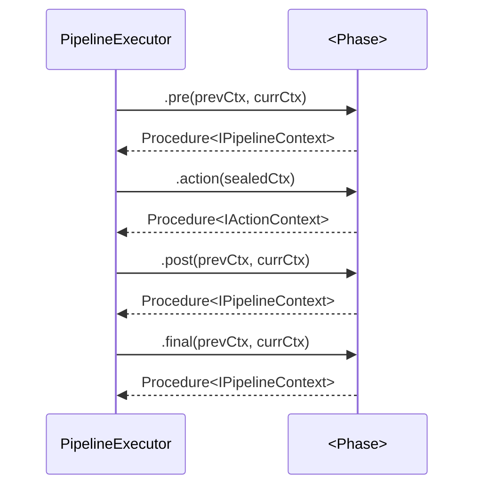

# Phases

> **Who this is for:** developers wiring a new bank, debugging a phase failure, or auditing the typed contract between phases.

Every phase implements [`BasePhase`](https://github.com/sergienko4/israeli-bank-scrapers/blob/{{BRANCH}}/src/Scrapers/Pipeline/Types/BasePhase.ts) and owns four sub-step hooks: `pre`, `action`, `post`, `final`. The `PipelineExecutor` drives them in order and threads an immutable `IPipelineContext` snapshot between phases.

## Browser banks — direct-API after login

| Slot | Phase | Always-on? | One-line role |
|---|---|---|---|
| 1 | [INIT](init.md) | ✅ | Launch Camoufox, build context, navigate to bank URL |
| 2 | [HOME](home.md) | ✅ | Landing-page discovery, signal login readiness |
| 3 | [PRE-LOGIN](pre-login.md) | ⚙️ | "Show login" toggle (Amex, Isracard, Max, VisaCal) |
| 4 | [LOGIN](login.md) | ✅ | 7-strategy `SelectorResolver` + declarative `LoginConfig` |
| 5 | [OTP-TRIGGER](otp-trigger.md) | ⚙️ | Ask bank to dispatch SMS |
| 6 | [OTP-FILL](otp-fill.md) | ⚙️ | Fill the code from `otpCodeRetriever` |
| 7 | [AUTH-DISCOVERY](auth-discovery.md) | ✅ | Capture post-login auth token + API origin |
| 8 | `BIND-API-MEDIATOR` | ✅ | Bind an authenticated `ApiMediator` to the live page; prime bearer / session token |
| 9 | [API-DIRECT-SCRAPE](api-direct-scrape.md) | ✅ | Walk the bank's hard-model shape (accounts + balances + transactions) — no nav; `.final` emits `ctx.balanceResolution` |
| 10 | [TERMINATE](terminate.md) | ✅ | Close browser, finalise result |
| — | _dormant_: [ACCOUNT-RESOLVE](account-resolve.md) · [DASHBOARD](dashboard.md) · [SCRAPE](scrape.md) · [BALANCE-RESOLVE](balance-resolve.md) | — | Retired generic navigation + DOM-scrape chain; still in the tree (ESLint-canary-guarded) but unused by any pipeline bank |

## API-direct banks — 2 phases

| Phase | Replaces (browser side) | One-line role |
|---|---|---|
| [API-DIRECT-CALL](api-direct-call.md) | INIT → HOME → … → OTP-FILL | Login + OTP via JSON API |
| [API-DIRECT-SCRAPE](api-direct-scrape.md) | shared — the same scrape phase browser banks run | Shape-driven walk; `.final` emits `ctx.balanceResolution` |

## Sub-step contract template

| Hook | Owns | Cannot |
|---|---|---|
| `.pre` | Read shared slots, plan the action | Modify slots outside the phase's declared scope |
| `.action` | Execute the work; sealed action-context — no mediator, no network discovery | Reach outside `IActionContext`; mutate prior slots |
| `.post` | Validate, partition, hard-fail on universal failure | Re-run the action |
| `.final` | Commit one new slot to `IPipelineContext` | Touch other phases' slots |

Failure at any sub-step returns `Procedure fail` — the executor records `errorType` + `errorMessage` and the run terminates cleanly through the rest of the chain's `.final` hooks (no half-finished state).
