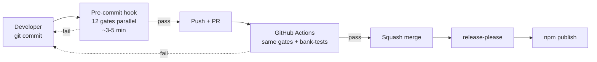

# Workflow

> **Who this is for:** maintainers and contributors who want to understand the CI gate matrix, the pre-commit hook, and the branch + release flow.

## In this section

| Page | What it covers |
|---|---|
| [CI gates](ci.md) | Every check that runs on a PR, what fails it, where to look for the log |
| [Pre-commit hook](pre-commit.md) | 12 quality gates run in parallel before any commit lands locally |
| [Branch flow & release-please](branch-flow.md) | Branch policy, PR rules, release-please automated versioning |

## Two lines of defense

The pre-commit hook gives developers fast local feedback (3-5 min); the CI re-runs the same gates as a second safety net. Either failing rolls back the change.
