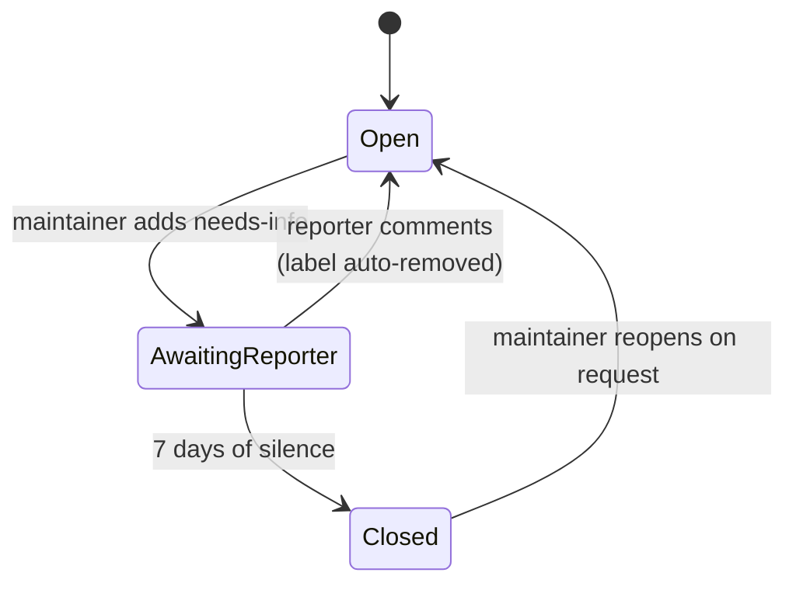

# Issue triage automation

> **Who this is for:** maintainers triaging incoming issues, and reporters
> wondering why an issue was closed automatically.

The repository runs two independent staleness lanes, both in
[`.github/workflows/stale.yml`](https://github.com/sergienko4/israeli-bank-scrapers/blob/{{BRANCH}}/.github/workflows/stale.yml).
They exist for different reasons and must not be confused.

| Lane | Scope | Trigger | Timing | Outcome |
| ---- | ----- | ------- | ------ | ------- |
| **General inactivity** (`stale` job) | issues **and** PRs | no activity at all | 60 days → `Stale`, 14 more → close | closed `not_planned` |
| **Awaiting the reporter** (`no-response` job) | issues only | maintainer applies `needs-info` | 7 days of silence → close | closed `not_planned`, labelled `closed-no-response` |

`needs: stale` orders the two jobs inside a run, and a `stale-issues`
concurrency group stops two runs overlapping — a manual dispatch landing on top
of the nightly cron would otherwise have both lanes acting on the same issue
and double-spending the API rate limit.

The lanes stay disjoint by arithmetic rather than by exemption: both measure
from `updated_at`, and seven days elapses before sixty, so an issue carrying
`needs-info` is always closed by the fast lane first. The general lane is
deliberately *not* made to skip `needs-info`, because that would remove the
only backstop if the fast lane ever stopped firing.

## The label is the state machine

`actions/stale` decides staleness from `updated_at`. It knows an issue is
quiet; it has no idea **whose turn it is**. The `needs-info` label supplies
that missing half: the seven-day clock runs only while the label is present.



Two consequences follow, and both are enforced by
`src/Tests/Unit/Pipeline/CrossValidation/NoResponseIssueGate.test.ts`
(the `NRI-*` assertions), because each fails silently:

- **Something must clear the label when the reporter answers.**
  [`issue-needs-info-clear.yml`](https://github.com/sergienko4/israeli-bank-scrapers/blob/{{BRANCH}}/.github/workflows/issue-needs-info-clear.yml)
  does this on `issue_comment`. The built-in
  `labels-to-remove-when-unstale` is *not* enough: it fires only for an issue
  already marked stale, so it never covers a reply inside the first seven
  days. Without the companion workflow, an issue the reporter **did** answer
  would still be closed for silence.
- **The two lanes must not share a label.** The fast lane marks with
  `closed-no-response`, never the generic `Stale`, or the jobs would fight
  over one marker.

## For maintainers

Ask for what you need, then apply the label:

```bash
gh issue edit <number> -R sergienko4/israeli-bank-scrapers --add-label needs-info
```

- **Opt an issue out entirely:** add `not-stale`. Both lanes honour it.
- **Cancel the clock manually:** remove `needs-info`.
- The reporter's own reply removes the label automatically, so you do not need
  to watch the issue.
- The seven days run from when you apply `needs-info`, not from when the issue
  was opened — labelling an issue updates it, and that is the clock. Your own
  follow-up comments do extend the deadline, which errs on the generous side.
  A reply from the reporter removes the label and takes the issue out of scope
  altogether, which is stronger than restarting a timer.

## For reporters

If your issue was closed with `closed-no-response`, nothing is lost. Add the
information that was requested and ask for it to be reopened; the history is
intact. The closure means only that we could not investigate without those
details.

## Why "7 days" is configured as 7 + 0

`actions/stale` is a mark-then-close processor, so "close after seven days with
no warning period" is expressed as `days-before-issue-stale: 7` plus
`days-before-issue-close: 0`, which closes in the *same* run.

That is a verified property of the action, not an assumption. In
`actions/stale` v11.0.0, `_markStale` sets
`issue.updated_at = new Date().toString()` before the close check runs, and
`Date.toString()` keeps only whole seconds. The close check asks the inverse of
what you might expect — whether the issue *was* updated inside the close
window, `millisSinceLastUpdated <= 0` — and closes when the answer is no.
Because the stamp was truncated to the second, the elapsed value is between 1
and 999 ms, so the answer is no and the issue closes on the spot. Simulated
over 20 000 trials, this closes in the same run 100% of the time.
Setting the close window to `1` would instead defer every closure by a day.

One further trap, documented in the action's own `action.yml`: omitting
`stale-issue-message` does not merely make the bot quiet — with no message it
**will not mark issues stale at all**, silently disabling the lane. `NRI-10`
asserts the message is present for that reason. `close-issue-message` is
deliberately left unset so the same-run closure posts exactly one comment.

## Security posture

`issue-needs-info-clear.yml` is triggered by `issue_comment`, which is
attacker-reachable on a public repository, and it holds `issues: write`.

- Top-level `permissions: {}`; only the single job requests `issues: write`.
- No attacker-controlled text reaches the shell. The step passes only the
  repository slug and the numeric issue id through `env:` — never the comment
  body, issue title, or a user login — so there is no template-injection
  surface. `NRI-21` asserts this, and `NRI-24` proves that guard recognises
  every untrusted field of the event rather than passing because it matches
  nothing.
- The label removal re-reads the label list first, across every page. That
  guards a genuine race (the label being removed concurrently) rather than
  masking errors: a real API failure still fails the step. The endpoint pages
  at 30, so a first-page-only read on a heavily labelled issue could report
  the label absent and leave the lane free to close an issue the reporter had
  answered; `NRI-25` holds the pagination in place.

Both workflows are audited by the `zizmor` gate described in
[Code scanning triage](code-scanning.md), and pass with no findings.
