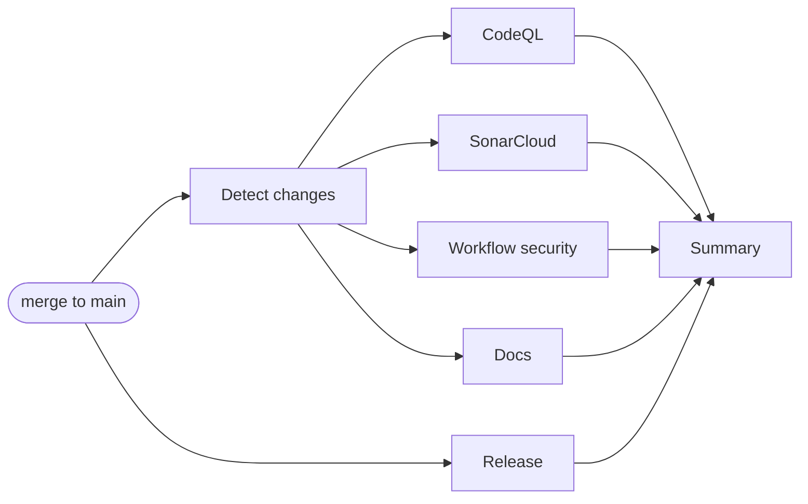

# Main pipeline (post-merge CI)

BLUF: every merge to `main` starts **exactly one workflow run** — `Main Pipeline`
— that calls every scan *and* the release, and ends with a single summary
answering "did this merge land cleanly, and did it ship anything?".

## The problem this solves

A merge used to start six unrelated workflow runs:

| Workflow | Why it ran post-merge |
|---|---|
| PR Validation | `push: main` re-ran the whole PR suite |
| CodeQL | `push: main` |
| SonarCloud | `push: main` |
| Workflow Security | `push: main` (path-filtered) |
| Publish Docs | `push: main` (path-filtered) |
| Release & Publish | `push: main` |

Nothing tied them together. Answering "is main healthy?" meant opening six
runs and reading each separately, and **PR Validation re-ran ~22 jobs that had
already passed on the PR minutes earlier** — including the slow ones. That
duplication was both the biggest waste of runner minutes and the main reason a
merge produced a wall of unreadable check runs.

## The shape now

`Detect changes` reproduces the path filter that `docs.yml` used to carry on
its own trigger — a reusable workflow call cannot take a `paths:` filter, so
the decision moves into a gate job. The other scans run on every merge.

`Release` is **not** gated on the scans. That preserves the behaviour release
had as a standalone workflow, where a flaky Sonar run could never block cutting
a release. The DAG reports both branches; it does not couple them.

`Summary` runs with `if: always()` and renders a Mermaid DAG plus a result
table into the run summary, so the outcome is readable without opening any
job. It **fails when any stage failed**, so a green summary can never sit next
to a red scan — or, now, a failed release.

## Reading the release row

On an ordinary merge, release-please only opens or refreshes the Release PR.
The npm publish happens later, on the merge of *that* PR. The summary spells
out which one happened rather than leaving `success` to be misread as
"shipped":

| Row | Meaning |
|---|---|
| `✅ success — no new version (Release PR updated)` | Ordinary merge. Nothing published. |
| `✅ success — published v8.6.7` | The Release PR was merged; that version is on npm. |
| `❌ failure` | Release or publish broke. Open the `Release` job. |

## Triggers after the change

| Workflow | `push: main` | Other triggers |
|---|---|---|
| `main-pipeline.yml` | **yes** | `workflow_dispatch` (with `force_publish`) |
| `release.yml` | no | `workflow_call` |
| `codeql.yml` | no | `workflow_call`, `pull_request`, `schedule` |
| `sonarcloud.yml` | no | `workflow_call`, `pull_request`, `workflow_dispatch` |
| `workflow-security.yml` | no | `workflow_call`, `pull_request`, `workflow_dispatch` |
| `docs.yml` | no | `workflow_call`, `workflow_dispatch` |
| `pr.yml` | no | `pull_request`, `workflow_dispatch` |

Six post-merge workflows became one.

## npm Trusted Publishing — the one external prerequisite

`release.yml` publishes with **npm Trusted Publishing**, which authenticates
over OIDC. npm validates the token's **caller** claim — the workflow that
*starts* the run, not the file that contains the publish step. npm's own
[troubleshooting guide](https://docs.npmjs.com/trusted-publishers/) is explicit:

> Some GitHub Actions workflows use `workflow_call` to invoke other workflows
> that run `npm publish` […] validation checks the calling workflow's name
> instead of the workflow that actually contains the publish command […] The
> `id-token: write` permission must also be given to both parent and child
> workflows.

So calling `release.yml` from here moves the publisher identity to the caller:

> The trusted publisher configured on npmjs.com must name
> **`main-pipeline.yml`**, not `release.yml`.

### What the workflows must keep satisfying

| Requirement | Where it is met |
|---|---|
| `id-token: write` on the **parent** | the `release` job in `main-pipeline.yml` |
| `id-token: write` on the **child** | the `publish` job in `release.yml` |
| GitHub-hosted runner (self-hosted unsupported) | `runs-on: ubuntu-latest` |
| npm ≥ 11.5.1 for the OIDC exchange | `npm install -g npm@11.11.0`, pinned and signature-checked |
| Node from a single source of truth | `node-version-file: .nvmrc` |
| `repository.url` matching the GitHub repo exactly | `package.json` |

Dropping any row breaks publishing with `ENEEDAUTH`. The parent/child
`id-token` pair is the easy one to lose, because the parent grant looks
redundant until you remember the token is minted for the *caller*.

Consequences to keep in mind:

- Renaming `main-pipeline.yml`, or moving the `release` job into a different
  workflow file, breaks publishing until that setting is repointed.
- Giving `release.yml` a `push:` trigger again would publish under a claim npm
  now rejects.
- A misconfiguration surfaces as a failed `publish` step, never as a silent
  bad publish.

## Known trade-offs

**Releases are never cancelled, so verification is not superseded either.**
Concurrency is a workflow-level setting, so folding release in means one
policy for both. It is `cancel-in-progress: false`, because a cancelled
publish is worse than a queued verification. Two merges landing close together
now queue rather than supersede.

**`workflow-security.yml` (zizmor) runs on every merge.** It used to be
path-filtered post-merge so it only ran when workflow files changed. A reusable
call cannot carry `paths:`, so it now runs every time. That is deliberate: it
is a roughly one-minute security scan, and continuously verifying workflow
hardening on `main` is worth more than the saved minute. Its PR trigger keeps
the path filter.

## Effect on branch protection

**None.** The required status contexts are `Validate` and `SonarCloud Scan`.
Both are produced by `pull_request` triggers, which this change does not
touch. No check was renamed, so no protection rule needed editing.

Removing `push: main` from `pr.yml` does not affect the `Validate` context: it
is a PR context, and PR runs are unchanged.

## Reading a failed run

1. Open the `Main Pipeline` run for the merge commit.
2. Read the summary table at the top — it names the failing stage.
3. Open only that job.

`skipped` is a normal result for `Docs` (it only publishes when docs-relevant
files change) and does not count as a failure.

## Recovering a missed publish

If release-please tagged a release but the publish did not run, re-run the
pipeline manually rather than hand-publishing:

**Actions → Main Pipeline → Run workflow → `force_publish: true`.**

The input is passed straight through to `release.yml`, which then publishes
without requiring a fresh release.

## Rollback

Reverting is mechanical, but **step 4 is not optional** — skipping it leaves
publishing broken.

1. Restore `push: { branches: [main] }` in `codeql.yml`, `sonarcloud.yml`,
   `workflow-security.yml`, `docs.yml` and `pr.yml`, restoring the `paths:`
   filters on `workflow-security.yml` and `docs.yml`.
2. Remove the `workflow_call:` trigger from those four scan workflows.
3. Restore `push: { branches: [main] }` and `workflow_dispatch:` on
   `release.yml`, and remove its `workflow_call:` trigger.
4. **Repoint the npm trusted publisher on npmjs.com back to `release.yml`.**
5. Delete `.github/workflows/main-pipeline.yml` and
   `.github/scripts/ci/pipeline-summary.sh`.

Branch protection needs no edit either way, because no check was renamed.
