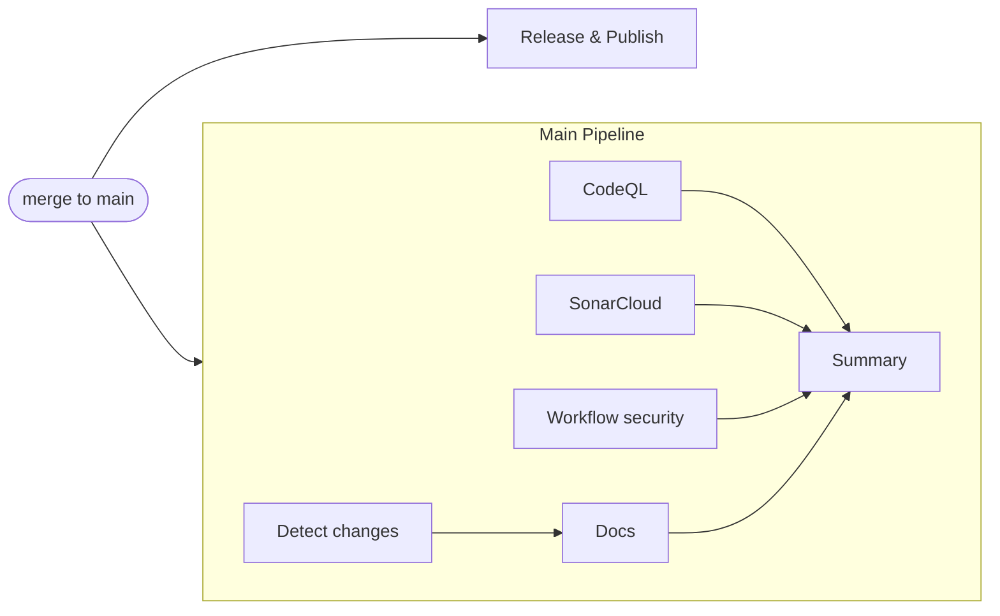

# Main pipeline (post-merge CI)

BLUF: every merge to `main` runs **one** workflow — `Main Pipeline` — that
calls the individual scans and ends with a single summary answering "did this
merge land cleanly?". Release and npm publish stay in their own workflow.

## The problem this solves

A merge used to start six unrelated workflow runs:

| Workflow | Why it ran post-merge |
|---|---|
| PR Validation | `push: main` re-ran the whole PR suite |
| CodeQL | `push: main` |
| SonarCloud | `push: main` |
| Workflow Security | `push: main` (path-filtered) |
| Publish Docs | `push: main` (path-filtered) |
| Release & Publish | `push: main` |

Nothing tied them together. Answering "is main healthy?" meant opening six
runs and reading each separately, and **PR Validation re-ran ~22 jobs that had
already passed on the PR minutes earlier** — including the slow ones. That
duplication was both the biggest waste of runner minutes and the main reason a
merge produced a wall of unreadable check runs.

## The shape now

`Detect changes` reproduces the path filter that `docs.yml` used to carry on
its own trigger — a reusable workflow call cannot take a `paths:` filter, so
the decision moves into a gate job. The other three scans run on every merge.

`Summary` runs with `if: always()` and renders a Mermaid DAG plus a result
table into the run summary, so the outcome is readable without opening any
job. It **fails when any upstream job failed**, so a green summary can never
sit next to a red scan.

## Triggers after the change

| Workflow | `push: main` | Other triggers |
|---|---|---|
| `main-pipeline.yml` | **yes** | `workflow_dispatch` |
| `release.yml` | **yes** | `workflow_dispatch` |
| `codeql.yml` | no | `workflow_call`, `pull_request`, `schedule` |
| `sonarcloud.yml` | no | `workflow_call`, `pull_request`, `workflow_dispatch` |
| `workflow-security.yml` | no | `workflow_call`, `pull_request`, `workflow_dispatch` |
| `docs.yml` | no | `workflow_call`, `workflow_dispatch` |
| `pr.yml` | no | `pull_request`, `workflow_dispatch` |

Six post-merge workflows became two.

## Why Release is not part of the DAG

`release.yml` publishes with `npm publish --provenance` using **npm Trusted
Publishing**, which authenticates over OIDC. npm validates the OIDC token's
workflow claim against the publisher configured on npmjs.com. Calling
`release.yml` as a reusable workflow changes that claim from `release.yml` to
`main-pipeline.yml`, which breaks publishing and can only be repaired by
reconfiguring the trusted publisher.

A tidier graph is not worth risking the release pipeline, so release keeps its
own `push: main` trigger. It is also genuinely a different concern: the
pipeline *verifies* a merge, release *ships* one.

## Effect on branch protection

**None.** The required status contexts are `Validate` and `SonarCloud Scan`.
Both are produced by `pull_request` triggers, which this change does not
touch. No check was renamed, so no protection rule needed editing.

Removing `push: main` from `pr.yml` does not affect the `Validate` context: it
is a PR context, and PR runs are unchanged.

## Reading a failed run

1. Open the `Main Pipeline` run for the merge commit.
2. Read the summary table at the top — it names the failing stage.
3. Open only that job.

`skipped` is a normal result for `Docs` (it only publishes when docs-relevant
files change) and does not count as a failure.

## Rollback

The change is fully reversible without touching any other system, because no
check was renamed and branch protection was never edited.

1. Restore `push: { branches: [main] }` in `codeql.yml`, `sonarcloud.yml`,
   `workflow-security.yml`, `docs.yml` and `pr.yml`, restoring the `paths:`
   filters on `workflow-security.yml` and `docs.yml`.
2. Remove the `workflow_call:` trigger from those four scan workflows.
3. Delete `.github/workflows/main-pipeline.yml` and
   `.github/scripts/ci/pipeline-summary.sh`.

The old behaviour returns on the next merge. Nothing needs to be reconfigured
on GitHub or npmjs.com.

## Known trade-off

`workflow-security.yml` (zizmor) used to be path-filtered post-merge so it only
ran when workflow files changed. A reusable call cannot carry `paths:`, so it
now runs on **every** merge. That is deliberate: it is a roughly one-minute
security scan, and continuously verifying workflow hardening on `main` is worth
more than the saved minute. Its PR trigger keeps the path filter.
