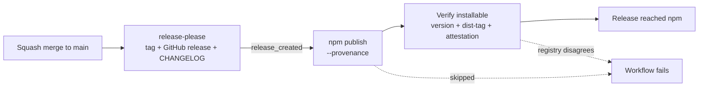

# Releases and the signals consumers see

> **Who this is for:** maintainers asking "we published — why does npm/GitHub
> still show nothing?", and anyone auditing what this package proves about
> itself.

## What a release actually does

Two guards exist because `npm publish` exiting `0` is a weaker claim than it
looks:

| Guard | Failure it catches |
| --- | --- |
| `Verify the release is installable` | The tarball was accepted but `dist-tags.latest` still points at the previous version, so `npm install` keeps serving old code — or the OIDC exchange degraded and published without provenance |
| `Release reached npm` | The `publish` job was **skipped**. A skipped job is not a red workflow, so the tag, GitHub release and CHANGELOG all say "shipped" while npm serves the previous version |

Both live in [`.github/workflows/release.yml`](https://github.com/sergienko4/israeli-bank-scrapers/blob/main/.github/workflows/release.yml).

## Signals we control

| Signal | Where it comes from | How it is kept honest |
| --- | --- | --- |
| Provenance attestation | `publishConfig.provenance` + Trusted Publishing OIDC | Release workflow fails if the published version has no attestation |
| `dist-tags.latest` | `npm publish` | Polled back from the registry after every publish |
| Supported Node range | `engines.node` | Unit suite runs on the floor, latest 22.x, latest 24.x and latest 26.x; `npm run lint:node-support` fails the build if `.nvmrc`, `engines.node`, the CI matrix and the README table disagree |
| Upgrade notes | `compatibility.json` | `npm run compat:check` diffs the generated page against its source |

## Node support policy

Two claims are easy to conflate, and only one of them can break someone:

| Claim | Declared in | May move |
| --- | --- | --- |
| What we **build and publish on** | `.nvmrc` (consumed by `release.yml`, `docs.yml`, CI) | Any time — it is invisible to consumers |
| What we **require of consumers** | `engines.node`, plus `target` in `tsup.config.ts` | Only in a **major** — raising the floor breaks working installs |

Raising `engines.node` also moves `tsup`'s `target` from `node22` to `node24`,
because the emitted bundle is downlevelled to the **oldest** runtime we promise,
not the one we develop on. Those two move together or we ship a bundle using
syntax the advertised floor cannot parse.

**Current state**, against Node's
[release schedule](https://github.com/nodejs/release#release-schedule):

| Node | Upstream status | Our position |
| --- | --- | --- |
| 22.x | Maintenance LTS, EOL 2027-04-30 | The `engines.node` floor; supported for all of `8.x` |
| 24.x | Active LTS since 2025-10-28 | Tested on every PR; the intended floor after the next major |
| 26.x | Current, LTS from 2026-10-28 | In the unit matrix, on the same trigger as 22.x and 24.x; not a candidate floor until it reaches LTS |

So the roadmap is: **a future major raises the floor to `>= 24` and drops 22.x.**
It is announced in the README rather than done quietly at the moment 22 goes
EOL, because a consumer who reads `>= 22.14.0` today should not discover the
change from a failed install. `npm run lint:node-support` fails the build if only
some of these declarations move.

## Why the Dependabot compatibility score says "unknown"

This is the most common "our release is broken" report, and it is neither a
bug nor something a publisher can fix.

**What the score is.** Per
[GitHub's documentation](https://docs.github.com/en/code-security/concepts/supply-chain-security/dependabot-security-updates#about-compatibility-scores),
a compatibility score is

> calculated from CI tests in **other public repositories** where the same
> security update has been generated. An update's compatibility score is the
> **percentage of CI runs that passed**.

Three consequences follow directly:

1. **It is computed downstream, not published upstream.** No field in
   `package.json`, no workflow, and no registry metadata can set it. It is
   derived from strangers' CI runs.
2. **It is per *version pair*, not per package.** The score for
   `8.6.6 → 8.6.7` says nothing about `8.6.7 → 8.6.8`.
3. **It accrues after the fact.** On release day no downstream repository has
   attempted the upgrade yet, so the sample size is zero.

**Measured evidence.** Querying the badge endpoint directly for a range of
packages:

| Dependency | Version pair | Score |
| --- | --- | --- |
| `lodash` | 4.17.20 → 4.17.21 | 93% |
| `eslint-plugin-jsdoc` | 63.3.2 → 63.3.3 | 89% |
| `eslint-plugin-jsdoc` | 63.3.3 → 64.2.0 | 57% |
| `playwright-core` | 1.55.0 → 1.56.0 | **unknown** |
| `israeli-bank-scrapers` (upstream) | 6.2.0 → 6.3.0 | **unknown** |
| `@sergienko4/israeli-bank-scrapers` | 8.6.6 → 8.6.7 | **unknown** |

`playwright-core` is one of the most-installed packages in the ecosystem and
its newest pair still reads "unknown". The pattern is age and downstream
adoption, not package quality, configuration, or anything a publisher does.

**Conclusion.** "Unknown" on a fresh release is the expected state for *every*
package, including upstream and including far larger dependencies. Chasing it
is not actionable. What *is* actionable is everything in
[Signals we control](#signals-we-control) — provenance, an accurate
`dist-tags.latest`, an evidenced Node range, and honest upgrade notes. Those
are the claims a consumer can actually verify, and this repository fails its
own release when any of them stops being true.
